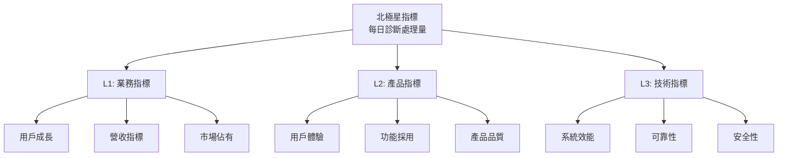
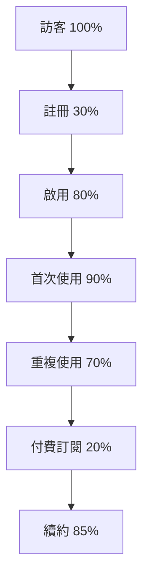
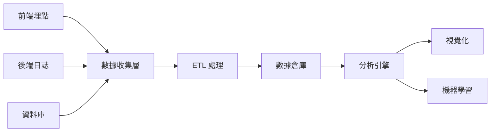
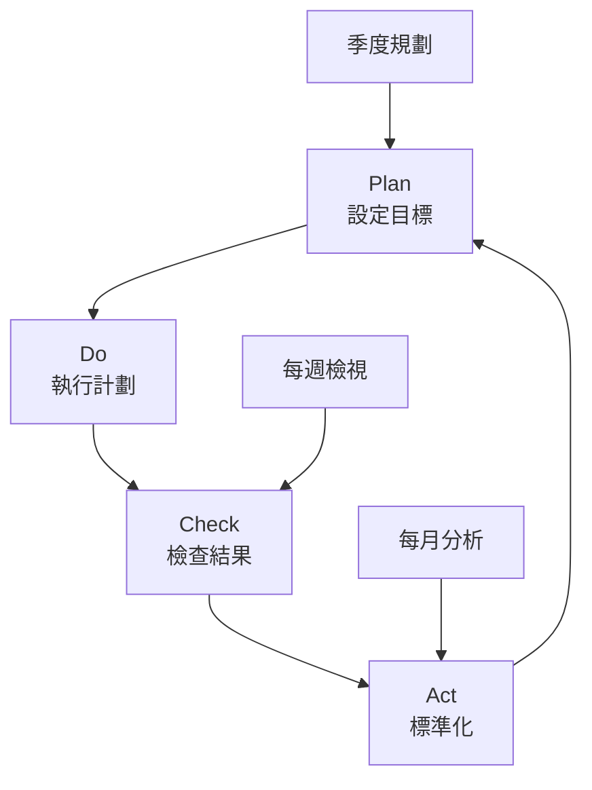

# 成功指標與 KPI 定義

## 指標體系架構

### 北極星指標 (North Star Metric)
**每日診斷影像處理量 (Daily Diagnostic Images Processed)**

```yaml
定義: 系統每日成功處理並產出診斷報告的醫療影像數量
目標: 月成長率 15%
計算: Σ(已完成診斷的 Studies) / 天
重要性: 直接反映平台核心價值創造
```

### 指標層級架構



---

## L1: 業務指標 (Business Metrics)

### 用戶成長指標

| 指標 | 定義 | 目標值 | 測量頻率 | 負責團隊 |
|------|------|--------|----------|----------|
| **MAU** | 月活躍用戶數 | 500+ | 每月 | 產品團隊 |
| **DAU** | 日活躍用戶數 | 100+ | 每日 | 產品團隊 |
| **DAU/MAU** | 黏著度 | >20% | 每月 | 產品團隊 |
| **新用戶成長率** | 月新增用戶/總用戶 | 10% | 每月 | 業務團隊 |
| **用戶流失率** | 月流失用戶/總用戶 | <5% | 每月 | 客戶成功 |

### 營收指標

| 指標 | 定義 | 目標值 | 測量頻率 | 負責團隊 |
|------|------|--------|----------|----------|
| **MRR** | 月經常性收入 | $50K | 每月 | 財務團隊 |
| **ARR** | 年經常性收入 | $600K | 每季 | 財務團隊 |
| **ARPU** | 每用戶平均收入 | $100 | 每月 | 財務團隊 |
| **LTV** | 用戶生命週期價值 | $3,600 | 每季 | 數據團隊 |
| **CAC** | 用戶獲取成本 | <$500 | 每月 | 行銷團隊 |
| **LTV/CAC** | 投資回報率 | >3.0 | 每季 | 管理層 |

### 市場指標

| 指標 | 定義 | 目標值 | 測量頻率 | 負責團隊 |
|------|------|--------|----------|----------|
| **市場佔有率** | 目標市場用戶比例 | 5% | 每年 | 策略團隊 |
| **NPS** | 淨推薦分數 | >70 | 每季 | 客戶成功 |
| **品牌知名度** | 無提示知名度 | 30% | 每年 | 行銷團隊 |
| **Win Rate** | 競標勝率 | >40% | 每月 | 銷售團隊 |

---

## L2: 產品指標 (Product Metrics)

### 用戶體驗指標

| 指標 | 定義 | 目標值 | 測量頻率 | 負責團隊 |
|------|------|--------|----------|----------|
| **CSAT** | 客戶滿意度 | >4.5/5 | 每月 | UX 團隊 |
| **任務完成率** | 成功完成核心任務% | >90% | 每週 | UX 團隊 |
| **平均任務時間** | 完成診斷時間 | <3分鐘 | 每日 | 產品團隊 |
| **錯誤率** | 用戶操作錯誤率 | <5% | 每週 | UX 團隊 |
| **支援票數** | 每百用戶票數 | <10 | 每週 | 支援團隊 |

### 功能採用指標

#### AI 功能採用
| 指標 | 定義 | 目標值 | 測量頻率 |
|------|------|--------|----------|
| **AI 使用率** | 使用 AI 輔助診斷% | >70% | 每日 |
| **AI 接受率** | 採納 AI 建議% | >60% | 每週 |
| **模型切換率** | 使用多模型比對% | >30% | 每月 |
| **AI 回饋率** | 提供 AI 改進回饋% | >20% | 每月 |

#### LLM 功能採用
| 指標 | 定義 | 目標值 | 測量頻率 |
|------|------|--------|----------|
| **LLM 查詢量** | 每用戶每日查詢 | >5 | 每日 |
| **回答滿意度** | 有用標記% | >80% | 每週 |
| **對話深度** | 平均對話輪次 | >3 | 每週 |
| **知識引用率** | 引用醫學文獻% | >40% | 每月 |

### 產品品質指標

| 指標 | 定義 | 目標值 | 測量頻率 | 負責團隊 |
|------|------|--------|----------|----------|
| **缺陷密度** | 每千行代碼缺陷 | <5 | 每版本 | QA 團隊 |
| **缺陷逃逸率** | 生產環境發現% | <10% | 每月 | QA 團隊 |
| **測試覆蓋率** | 代碼測試覆蓋 | >80% | 持續 | 開發團隊 |
| **迴歸缺陷率** | 重複出現缺陷% | <5% | 每版本 | QA 團隊 |

---

## L3: 技術指標 (Technical Metrics)

### 系統效能指標

| 指標 | 定義 | 目標值 | 測量頻率 | 警報閾值 |
|------|------|--------|----------|-----------|
| **API 延遲 P50** | 中位數回應時間 | <100ms | 即時 | >200ms |
| **API 延遲 P95** | 95 百分位 | <500ms | 即時 | >1s |
| **API 延遲 P99** | 99 百分位 | <1s | 即時 | >2s |
| **影像載入時間** | DICOM 載入 | <3s | 即時 | >5s |
| **AI 推論時間** | 模型推論 | <2s | 即時 | >5s |
| **吞吐量** | 每秒請求數 | >1000 | 即時 | <500 |

### 可靠性指標

| 指標 | 定義 | 目標值 | 測量頻率 | 事件級別 |
|------|------|--------|----------|-----------|
| **可用性** | 系統正常運行時間 | >99.9% | 即時 | <99.5% |
| **MTBF** | 平均故障間隔 | >720h | 每月 | <168h |
| **MTTR** | 平均修復時間 | <15min | 每事件 | >30min |
| **錯誤率** | HTTP 5xx 錯誤 | <0.1% | 即時 | >1% |
| **成功率** | API 成功調用 | >99.9% | 即時 | <99% |

### 資源利用指標

| 指標 | 定義 | 目標值 | 測量頻率 | 擴展閾值 |
|------|------|--------|----------|-----------|
| **CPU 使用率** | 平均 CPU 使用 | <70% | 即時 | >80% |
| **記憶體使用率** | 平均記憶體使用 | <80% | 即時 | >90% |
| **磁碟 I/O** | 讀寫延遲 | <10ms | 即時 | >20ms |
| **網路頻寬** | 使用率 | <60% | 即時 | >80% |
| **資料庫連接** | 活躍連接數 | <80% | 即時 | >90% |

---

## 關鍵里程碑指標

### Phase 1.0 - MVP (0-3月)
```yaml
成功標準:
  用戶數: 10+ 測試用戶
  功能完成度: 100% 核心功能
  系統穩定性: >95% 可用性
  AI 準確率: >85%
  用戶滿意度: >3.5/5

關鍵指標:
  - [ ] 完成 5 個核心模組
  - [ ] 通過 UAT 測試
  - [ ] 零重大缺陷
  - [ ] 文檔完整度 100%
```

### Phase 1.1 - 成長期 (3-6月)
```yaml
成功標準:
  用戶數: 100+ 付費用戶
  DAU: >50
  功能採用率: >60%
  AI 準確率: >90%
  NPS: >50

關鍵指標:
  - [ ] MRR 達到 $10K
  - [ ] 3 個機構採用
  - [ ] LLM 功能上線
  - [ ] 行動 App 發布
```

### Phase 2.0 - 擴展期 (6-12月)
```yaml
成功標準:
  用戶數: 500+ 付費用戶
  DAU/MAU: >25%
  市場佔有率: >2%
  AI 模型數: 10+
  NPS: >70

關鍵指標:
  - [ ] ARR 達到 $200K
  - [ ] 10+ 機構客戶
  - [ ] 國際化支援
  - [ ] 企業版發布
```

---

## 診斷性指標 (Diagnostic Metrics)

### 漏斗分析指標



| 階段 | 轉換率 | 目標 | 優化重點 |
|------|--------|------|----------|
| **註冊轉換** | 30% | 40% | 簡化流程 |
| **啟用率** | 80% | 90% | 引導教學 |
| **首次使用** | 90% | 95% | 快速價值 |
| **留存率** | 70% | 80% | 功能黏性 |
| **付費轉換** | 20% | 30% | 價值展示 |
| **續約率** | 85% | 90% | 客戶成功 |

### 同類群組分析

| 群組 | 定義 | 關鍵指標 | 特殊追蹤 |
|------|------|----------|-----------|
| **新用戶** | <30天 | 啟用率、首週留存 | Onboarding 完成度 |
| **活躍用戶** | DAU | 功能使用深度 | AI 採用率 |
| **高價值用戶** | Top 20% | LTV、推薦率 | 擴展機會 |
| **風險用戶** | 活躍度下降 | 流失預警 | 挽留措施 |
| **流失用戶** | 30天未登入 | 流失原因 | 召回策略 |

---

## 實時監控儀表板

### 營運儀表板配置

#### 即時監控面板
```yaml
即時指標:
  - 在線用戶數
  - 當前 QPS
  - API 延遲 (P50/P95/P99)
  - 錯誤率
  - CPU/Memory 使用率

更新頻率: 10 秒
視覺化: 即時圖表、熱力圖
警報: 異常自動通知
```

#### 每日業務面板
```yaml
業務指標:
  - DAU/MAU
  - 新增用戶
  - 診斷處理量
  - AI 使用率
  - 用戶滿意度

更新頻率: 每小時
視覺化: 趨勢圖、環比對比
報告: 每日郵件摘要
```

#### 週期性分析面板
```yaml
分析指標:
  - 用戶留存曲線
  - 功能採用漏斗
  - 收入成長趨勢
  - 競品對比分析
  - 預測模型

更新頻率: 每週/每月
視覺化: 詳細報表、預測圖
用途: 策略決策支援
```

---

## 資料收集與分析架構

### 資料收集管道



### 分析工具鏈

| 工具 | 用途 | 資料類型 | 使用團隊 |
|------|------|----------|----------|
| **Google Analytics** | 用戶行為 | 前端事件 | 產品團隊 |
| **Mixpanel** | 產品分析 | 用戶旅程 | 產品團隊 |
| **Prometheus** | 系統監控 | 技術指標 | DevOps |
| **Grafana** | 視覺化 | 所有指標 | 全公司 |
| **Tableau** | 商業智能 | 業務數據 | 管理層 |
| **Python/R** | 深度分析 | 原始數據 | 數據團隊 |

---

## 指標預警機制

### 預警級別定義

| 級別 | 顏色 | 定義 | 響應時間 | 處理流程 |
|------|------|------|----------|----------|
| **P0-緊急** | 🔴 紅 | 系統故障/資料損失 | 立即 | 全員響應 |
| **P1-嚴重** | 🟠 橙 | 功能失效/效能降級 | 15分鐘 | 值班處理 |
| **P2-重要** | 🟡 黃 | 指標異常/趨勢惡化 | 1小時 | 團隊處理 |
| **P3-一般** | 🔵 藍 | 輕微偏差/待觀察 | 4小時 | 計劃處理 |

### 自動化響應規則

```yaml
規則引擎:
  - 條件: API 錯誤率 > 1%
    動作:
      - 發送 P1 警報
      - 自動擴容
      - 啟用降級

  - 條件: DAU 下降 > 20%
    動作:
      - 發送 P2 警報
      - 觸發用戶調研
      - 分析流失原因

  - 條件: AI 準確率 < 85%
    動作:
      - 發送 P2 警報
      - 切換備用模型
      - 通知 AI 團隊
```

---

## 持續改進框架

### PDCA 循環



### 指標審查節奏

| 節奏 | 審查內容 | 參與者 | 輸出 |
|------|----------|--------|------|
| **每日站會** | 即時指標 | 開發團隊 | 問題處理 |
| **週會** | 產品指標 | 產品團隊 | 優化計劃 |
| **月會** | 業務指標 | 管理層 | 策略調整 |
| **季度會議** | 全面審查 | 全公司 | OKR 更新 |

---

## 成功案例指標

### 標竿案例

| 醫院 | 採用前 | 採用後 | 改善幅度 | 關鍵因素 |
|------|--------|--------|----------|----------|
| **A醫學中心** | 5分鐘/診斷 | 2分鐘/診斷 | -60% | AI 輔助 |
| **B區域醫院** | 70% 準確率 | 92% 準確率 | +31% | 多模型驗證 |
| **C診所聯盟** | 24小時報告 | 2小時報告 | -92% | 自動化流程 |

### ROI 計算模型

```yaml
投資回報計算:
  節省時間價值:
    公式: (節省時間 × 時薪 × 診斷量)
    範例: (3分鐘 × $100/小時 × 1000/月) = $5,000/月

  準確率提升價值:
    公式: (降低誤診率 × 平均賠償 × 案例數)
    範例: (5% × $50,000 × 10/年) = $25,000/年

  效率提升價值:
    公式: (增加診斷量 × 單價)
    範例: (20% × 1000 × $50) = $10,000/月

總 ROI:
  公式: (總收益 - 總成本) / 總成本 × 100%
  目標: >200% 年化
```

---

*本章節定義產品成功的量化標準與追蹤機制*
*最後更新：2024-11-12*