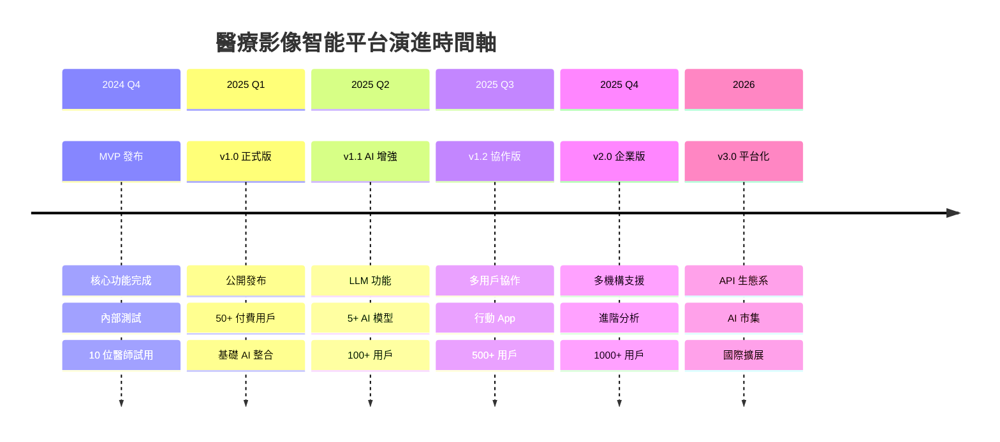
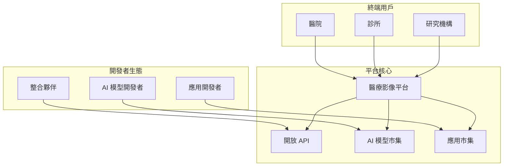
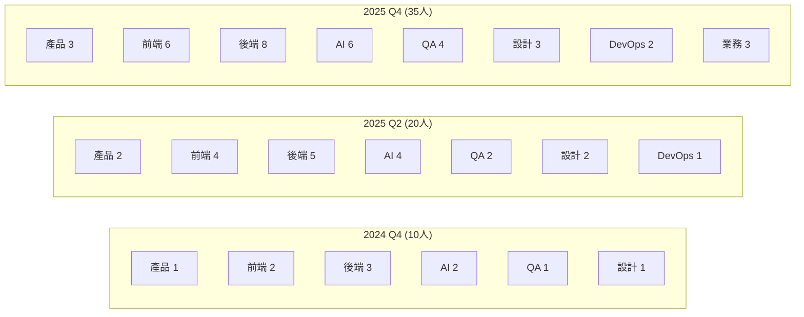

# 產品路線圖與發布策略

## 產品演進總覽

### 三年願景路線圖



---

## Phase 1.0: MVP (2024 Q4)

### 版本目標
**打造核心價值驗證版本，證明產品概念可行性**

### 功能範圍

#### 必要功能 (Must Have)
| 功能模組 | 具體功能 | 完成標準 | 狀態 |
|---------|---------|---------|------|
| **Study 管理** | 基本 CRUD | 可查詢、瀏覽 | ✅ |
| **影像檢視** | DICOM 顯示 | 2D 影像瀏覽 | ✅ |
| **文字病歷** | 病歷關聯 | 顯示相關病歷 | ✅ |
| **AI 基礎** | 單一模型 | 顯示 AI 結果 | 🔄 |
| **用戶系統** | 登入/權限 | 基本 RBAC | ✅ |

#### 技術實現
```yaml
前端:
  框架: React 18 + TypeScript
  UI: Ant Design 5
  狀態: Zustand

後端:
  框架: Django 4.2
  API: Django Ninja
  資料庫: PostgreSQL 15

部署:
  環境: Docker Compose
  主機: 單一 VPS
  備份: 每日備份
```

### 發布計劃

| 里程碑 | 日期 | 目標 | 驗收標準 |
|--------|------|------|----------|
| **Alpha** | 2024-11-15 | 內部測試 | 功能完整 |
| **Beta** | 2024-11-30 | 醫師測試 | 10 位用戶 |
| **RC** | 2024-12-10 | 穩定版 | 零嚴重缺陷 |
| **GA** | 2024-12-20 | 正式發布 | 生產就緒 |

---

## Phase 1.1: 成長版 (2025 Q1)

### 版本目標
**擴展 AI 能力，驗證商業模式，達到產品市場契合**

### 新增功能

#### AI 增強功能
| 功能 | 描述 | 優先級 | 預期效益 |
|------|------|--------|----------|
| **多模型支援** | 3+ AI 模型 | P0 | 準確率 +15% |
| **LLM 整合** | GPT-4 問答 | P0 | 用戶滿意度 +30% |
| **批量處理** | 批次診斷 | P1 | 效率 +50% |
| **模型比對** | 結果對比 | P1 | 信心度 +25% |

#### 用戶體驗優化
| 功能 | 描述 | 優先級 | 預期效益 |
|------|------|--------|----------|
| **個人化儀表板** | 客製化首頁 | P1 | 效率 +20% |
| **快速搜尋** | 全文檢索 | P0 | 查找時間 -60% |
| **鍵盤快捷鍵** | 快速操作 | P2 | 操作速度 +30% |
| **深色模式** | 護眼模式 | P2 | 用戶舒適度 |

### 商業模式驗證

```yaml
定價實驗:
  基礎版: $99/月
  專業版: $299/月
  企業版: 客製報價

目標指標:
  付費轉換率: >20%
  MRR: $10,000
  CAC: <$500
  LTV/CAC: >3.0
```

---

## Phase 1.2: 協作版 (2025 Q2-Q3)

### 版本目標
**打造團隊協作能力，支援行動場景，提升產品黏性**

### 協作功能矩陣

| 功能類別 | Q2 功能 | Q3 功能 | 商業價值 |
|---------|---------|---------|----------|
| **即時協作** | 評論標註 | 即時討論 | 團隊效率 +40% |
| **工作流程** | 審核流程 | 自訂流程 | 合規性提升 |
| **知識管理** | 病例庫 | 知識圖譜 | 診斷準確率 +20% |
| **團隊管理** | 權限管理 | 績效追蹤 | 管理效率 +35% |

### 行動版策略

#### iOS/Android App
```yaml
Q2 目標:
  功能: 核心診斷功能
  平台: iOS 優先
  用戶: 100+ 下載

Q3 目標:
  功能: 完整功能
  平台: iOS + Android
  用戶: 500+ 活躍用戶

技術方案:
  框架: React Native
  同步: 即時同步
  離線: 基礎離線支援
```

### 市場擴展計劃

| 市場區隔 | Q2 策略 | Q3 策略 | 目標客戶數 |
|---------|---------|---------|------------|
| **醫學中心** | 試點合作 | 正式銷售 | 3-5 家 |
| **區域醫院** | 早鳥優惠 | 標準定價 | 10-15 家 |
| **診所聯盟** | 免費試用 | 團購方案 | 20-30 家 |
| **個人醫師** | 免費版 | 付費升級 | 100+ 位 |

---

## Phase 2.0: 企業版 (2025 Q4)

### 版本目標
**企業級功能完善，多機構支援，建立競爭壁壘**

### 企業功能

#### 多租戶架構
```yaml
資料隔離:
  方式: Schema-based
  安全: Row-level security
  效能: Connection pooling

客製化:
  介面: 品牌客製
  流程: 工作流引擎
  整合: API 開放

管理功能:
  使用統計: 即時儀表板
  費用控制: 預算管理
  合規報告: 自動生成
```

#### 進階分析
| 分析類型 | 功能描述 | 目標用戶 | 商業價值 |
|---------|---------|----------|----------|
| **品質分析** | 診斷品質追蹤 | 管理層 | 品質提升 30% |
| **效率分析** | 工作效率統計 | 部門主管 | 產能提升 40% |
| **成本分析** | ROI 計算 | 財務部門 | 成本降低 25% |
| **預測分析** | 趨勢預測 | 策略規劃 | 決策支援 |

### 國際化策略

| 地區 | 語言支援 | 合規要求 | 上線時間 |
|------|----------|----------|----------|
| **台灣** | 繁體中文 | 個資法 | 已完成 |
| **中國** | 簡體中文 | 網路安全法 | Q4 |
| **日本** | 日語 | J-MID | 2026 Q1 |
| **東南亞** | 英語 | 各國法規 | 2026 Q2 |

---

## Phase 3.0: 平台生態 (2026)

### 版本目標
**開放平台能力，建立生態系統，成為行業標準**

### 平台化架構



### API 經濟模型

| API 類型 | 計費模式 | 預期收入 | 目標夥伴 |
|---------|---------|----------|----------|
| **資料 API** | 按量計費 | $50K/月 | 研究機構 |
| **AI API** | 按次計費 | $30K/月 | 軟體廠商 |
| **整合 API** | 訂閱制 | $20K/月 | 系統整合商 |

---

## 發布策略

### 版本管理策略

#### 版本號規範
```
主版本.次版本.修訂版本-發布階段

範例：
- 1.0.0-alpha：內部測試版
- 1.0.0-beta：公測版
- 1.0.0-rc.1：發布候選版
- 1.0.0：正式版
- 1.0.1：修訂版
- 1.1.0：功能版本
- 2.0.0：重大升級
```

#### 發布週期
| 版本類型 | 週期 | 範圍 | 測試要求 |
|---------|------|------|----------|
| **修訂版** | 2 週 | Bug 修復 | 回歸測試 |
| **功能版** | 月度 | 新功能 | 完整測試 |
| **主版本** | 季度 | 重大更新 | 全面測試 |

### 部署策略

#### 藍綠部署
```yaml
步驟:
  1. 準備綠色環境（新版本）
  2. 部署新版本到綠色環境
  3. 測試綠色環境
  4. 切換流量到綠色環境
  5. 保留藍色環境作為回滾

優點:
  - 零停機部署
  - 快速回滾
  - 降低風險
```

#### 灰度發布
```yaml
階段:
  內部測試: 5% 流量
  早期用戶: 20% 流量
  擴大測試: 50% 流量
  全面發布: 100% 流量

監控指標:
  - 錯誤率
  - 效能指標
  - 用戶回饋
  - 業務指標
```

### 行銷策略

#### 產品發布計劃

| 階段 | 時間 | 活動 | 目標 |
|------|------|------|------|
| **預熱期** | T-30天 | 內容行銷、預告 | 建立期待 |
| **發布期** | T-0 | 發布會、媒體 | 最大曝光 |
| **推廣期** | T+30天 | 試用活動、優惠 | 用戶轉換 |
| **穩定期** | T+90天 | 案例分享、口碑 | 持續成長 |

#### 內容行銷計劃
```yaml
部落格:
  頻率: 每週 2 篇
  主題:
    - 產品教學
    - 醫療 AI 趨勢
    - 客戶案例
    - 技術分享

社群媒體:
  平台:
    - LinkedIn: B2B 內容
    - Twitter: 產品更新
    - YouTube: 教學影片
    - Facebook: 社群互動

網路研討會:
  頻率: 月度
  主題:
    - 產品演示
    - 最佳實踐
    - 新功能介紹
    - 客戶分享
```

---

## 風險管理

### 技術風險

| 風險 | 可能性 | 影響 | 緩解措施 | 應急計劃 |
|------|--------|------|----------|----------|
| **AI 模型失準** | 中 | 高 | 持續訓練優化 | 人工審核機制 |
| **系統擴展瓶頸** | 中 | 中 | 微服務架構 | 垂直擴展方案 |
| **資料安全事件** | 低 | 極高 | 多層防護 | 事件響應流程 |
| **技術債累積** | 高 | 中 | 定期重構 | 技術債管理 |

### 市場風險

| 風險 | 可能性 | 影響 | 緩解措施 | 應急計劃 |
|------|--------|------|----------|----------|
| **競爭對手進入** | 高 | 高 | 建立護城河 | 差異化策略 |
| **法規變化** | 中 | 高 | 持續監控 | 快速適應 |
| **市場接受度低** | 中 | 高 | MVP 驗證 | 產品調整 |
| **經濟環境惡化** | 低 | 中 | 成本控制 | 精簡運營 |

---

## 資源規劃

### 團隊編制計劃



### 預算分配

| 項目 | 2024 Q4 | 2025 H1 | 2025 H2 | 用途說明 |
|------|---------|---------|---------|----------|
| **研發** | 70% | 60% | 50% | 產品開發 |
| **行銷** | 10% | 20% | 25% | 市場推廣 |
| **營運** | 15% | 15% | 20% | 基礎設施 |
| **其他** | 5% | 5% | 5% | 行政管理 |
| **總額** | $200K | $500K | $800K | - |

---

## 成功標準與檢查點

### 階段性成功標準

#### 2024 Q4 檢查點
- [ ] MVP 功能 100% 完成
- [ ] 10 位醫師測試回饋
- [ ] 系統穩定性 >95%
- [ ] 基礎文檔完成

#### 2025 Q1 檢查點
- [ ] 50+ 付費用戶
- [ ] MRR $10K
- [ ] AI 準確率 >85%
- [ ] NPS >50

#### 2025 Q2 檢查點
- [ ] 200+ 付費用戶
- [ ] MRR $30K
- [ ] 3 家機構客戶
- [ ] 行動 App 上線

#### 2025 Q3 檢查點
- [ ] 500+ 付費用戶
- [ ] MRR $50K
- [ ] 10 家機構客戶
- [ ] 團隊規模 30人

#### 2025 Q4 檢查點
- [ ] 1000+ 付費用戶
- [ ] ARR $1M
- [ ] 20+ 機構客戶
- [ ] Series A 募資

### 退出標準

```yaml
停止信號:
  - 6個月 MRR 無成長
  - 用戶流失率 >15%
  - CAC/LTV <0.3
  - 技術債務失控

轉向信號:
  - PMF 指標未達標
  - 競爭環境劇變
  - 法規重大變化
  - 資金鏈斷裂風險
```

---

## 長期願景

### 五年目標 (2029)

```yaml
業務目標:
  用戶數: 10,000+
  ARR: $50M
  市場佔有率: 15%
  國際市場: 5+ 國家

產品目標:
  AI 模型: 50+
  API 夥伴: 100+
  整合系統: 20+
  平台生態: 成熟

組織目標:
  團隊規模: 200+
  研發中心: 3 個
  專利數: 20+
  IPO 準備: 完成
```

### 使命與願景

> **使命**：讓每位醫療專業人員都能擁有 AI 驅動的第二雙眼睛
>
> **願景**：成為全球醫療影像 AI 診斷的領導平台
>
> **價值觀**：
> - 病患第一
> - 持續創新
> - 開放協作
> - 追求卓越

---

*本章節定義產品發展路線圖與發布策略*
*最後更新：2024-11-12*