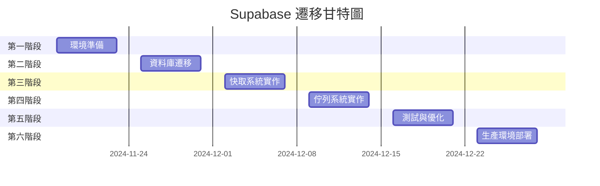

# Supabase 遷移執行計劃

## 遷移時程總覽



---

## 第一階段：環境準備（第1週）

### 目標
建立 Supabase 開發環境並完成初始配置

### 詳細任務清單

| 任務編號 | 任務內容 | 負責人 | 預計工時 | 前置條件 | 完成標準 |
|---------|---------|--------|---------|----------|---------|
| 1.1 | 建立 Supabase 專案 | DevOps | 2h | - | 專案建立完成 |
| 1.2 | 設定開發/測試/生產環境 | DevOps | 4h | 1.1 | 三環境就緒 |
| 1.3 | 配置 Supavisor 連線池 | DBA | 2h | 1.2 | 連線池測試通過 |
| 1.4 | 建立備份策略 | DBA | 3h | 1.2 | 備份腳本完成 |
| 1.5 | 設定監控告警 | DevOps | 4h | 1.2 | 監控面板上線 |
| 1.6 | 建立回滾計劃文件 | 架構師 | 4h | 1.1-1.5 | 文件審核通過 |
| 1.7 | 團隊培訓 | 架構師 | 4h | 1.6 | 培訓完成 |

### 交付成果
- ✅ Supabase 三環境配置完成
- ✅ 連線池與備份策略就位
- ✅ 監控系統運作正常
- ✅ 團隊具備基本操作能力

### 風險與緩解

| 風險 | 可能性 | 影響 | 緩解措施 |
|------|--------|------|----------|
| 環境配置錯誤 | 中 | 高 | 使用 IaC 工具自動化 |
| 權限設定問題 | 低 | 中 | 預先規劃權限矩陣 |
| 網路連線問題 | 低 | 高 | 準備 VPN 備案 |

---

## 第二階段：資料庫遷移（第2週）

### 目標
將現有 PostgreSQL 資料無縫遷移至 Supabase

### 詳細任務清單

| 任務編號 | 任務內容 | 負責人 | 預計工時 | 前置條件 | 完成標準 |
|---------|---------|--------|---------|----------|---------|
| 2.1 | 匯出現有資料庫 Schema | DBA | 2h | - | SQL 檔案產生 |
| 2.2 | Schema 相容性調整 | DBA | 4h | 2.1 | 相容性測試通過 |
| 2.3 | 建立 Supabase 資料表 | DBA | 3h | 2.2 | 所有表建立完成 |
| 2.4 | 資料匯出（分批） | DBA | 6h | 2.3 | 資料檔案就緒 |
| 2.5 | 資料匯入 Supabase | DBA | 8h | 2.4 | 資料載入完成 |
| 2.6 | 資料完整性驗證 | QA | 4h | 2.5 | 驗證報告通過 |
| 2.7 | 效能基準測試 | DBA | 4h | 2.6 | 基準數據建立 |
| 2.8 | 建立同步機制 | 後端 | 6h | 2.7 | 雙寫機制就緒 |

### 遷移腳本

```bash
#!/bin/bash
# 資料庫遷移腳本

# 1. 匯出 Schema
pg_dump -h $OLD_HOST -U $OLD_USER -d $OLD_DB \
  --schema-only > schema.sql

# 2. 匯出資料（分批）
pg_dump -h $OLD_HOST -U $OLD_USER -d $OLD_DB \
  --data-only --table=studies_study \
  --where="order_datetime >= '2024-01-01'" \
  > data_studies.sql

# 3. 匯入 Supabase
psql $SUPABASE_DB_URL < schema.sql
psql $SUPABASE_DB_URL < data_studies.sql

# 4. 驗證資料
psql $SUPABASE_DB_URL -c "
  SELECT tablename, n_live_tup
  FROM pg_stat_user_tables
  ORDER BY n_live_tup DESC;"
```

### 資料驗證檢查表

| 檢查項目 | 預期結果 | 實際結果 | 狀態 |
|---------|---------|---------|------|
| Study 記錄總數 | 50,000 | - | ⏳ |
| Report 記錄總數 | 10,000 | - | ⏳ |
| 索引建立完整 | 15個 | - | ⏳ |
| 外鍵約束正確 | 5個 | - | ⏳ |
| 查詢效能 | <10ms | - | ⏳ |

---

## 第三階段：快取系統實作（第3週）

### 目標
實作並部署資料庫支援的快取系統

### 詳細任務清單

| 任務編號 | 任務內容 | 負責人 | 預計工時 | 前置條件 | 完成標準 |
|---------|---------|--------|---------|----------|---------|
| 3.1 | 建立快取資料表 | DBA | 2h | - | 表與索引建立 |
| 3.2 | 實作快取後端類別 | 後端 | 8h | 3.1 | 單元測試通過 |
| 3.3 | 整合 Django 設定 | 後端 | 3h | 3.2 | 設定檔更新 |
| 3.4 | 實作過期清理機制 | 後端 | 4h | 3.3 | 排程任務運作 |
| 3.5 | 效能測試 | QA | 4h | 3.4 | 延遲 <30ms |
| 3.6 | 負載測試 | QA | 4h | 3.5 | 1000 QPS 通過 |
| 3.7 | 監控整合 | DevOps | 3h | 3.6 | Grafana 面板 |
| 3.8 | 文件撰寫 | 技術寫手 | 4h | 3.7 | 文件完成 |

### 快取效能目標

| 指標 | 目標值 | 可接受範圍 | 告警閾值 |
|------|--------|------------|---------|
| 命中率 | >80% | 60-80% | <60% |
| 讀取延遲 P50 | 15ms | 15-25ms | >25ms |
| 讀取延遲 P99 | 30ms | 30-50ms | >50ms |
| 寫入延遲 P50 | 20ms | 20-30ms | >30ms |
| 過期清理時間 | <1s | 1-3s | >3s |

### 測試案例

```python
# 快取測試案例
def test_cache_performance():
    """測試快取效能"""
    import time
    from django.core.cache import cache

    # 測試寫入效能
    start = time.time()
    for i in range(100):
        cache.set(f'test_key_{i}', {'data': i}, 300)
    write_time = time.time() - start
    assert write_time < 3.0  # 100次寫入 < 3秒

    # 測試讀取效能
    start = time.time()
    for i in range(100):
        value = cache.get(f'test_key_{i}')
    read_time = time.time() - start
    assert read_time < 2.0  # 100次讀取 < 2秒

    # 測試命中率
    hits = sum(1 for i in range(100)
               if cache.get(f'test_key_{i}') is not None)
    assert hits >= 95  # 命中率 >= 95%
```

---

## 第四階段：佇列系統實作（第4週）

### 目標
建立可靠的資料庫支援工作佇列系統

### 詳細任務清單

| 任務編號 | 任務內容 | 負責人 | 預計工時 | 前置條件 | 完成標準 |
|---------|---------|--------|---------|----------|---------|
| 4.1 | 建立佇列資料表 | DBA | 2h | - | 表結構建立 |
| 4.2 | 實作 JobQueue 類別 | 後端 | 8h | 4.1 | API 測試通過 |
| 4.3 | 實作 Worker 處理器 | 後端 | 6h | 4.2 | 工作處理正常 |
| 4.4 | 重試機制實作 | 後端 | 4h | 4.3 | 指數退避運作 |
| 4.5 | 死信佇列處理 | 後端 | 3h | 4.4 | 失敗處理完善 |
| 4.6 | 並發測試 | QA | 4h | 4.5 | 10 workers OK |
| 4.7 | 監控與告警 | DevOps | 4h | 4.6 | 告警規則設定 |
| 4.8 | 部署 Worker | DevOps | 3h | 4.7 | Supervisor 配置 |

### Worker 配置

```yaml
# supervisor 配置
[program:queue_worker_email]
command=python manage.py queue_worker email_queue
directory=/app
autostart=true
autorestart=true
stopasgroup=true
numprocs=2
process_name=%(program_name)s_%(process_num)02d

[program:queue_worker_report]
command=python manage.py queue_worker report_queue
directory=/app
autostart=true
autorestart=true
stopasgroup=true
numprocs=1
```

### 佇列監控指標

| 佇列 | 深度告警 | 延遲告警 | 失敗率告警 |
|------|---------|---------|------------|
| email_queue | >100 | >30s | >5% |
| report_queue | >50 | >5m | >10% |
| export_queue | >20 | >10m | >15% |
| notification_queue | >200 | >10s | >3% |

---

## 第五階段：測試與優化（第5週）

### 目標
全面測試並優化系統效能

### 詳細任務清單

| 任務編號 | 任務內容 | 負責人 | 預計工時 | 前置條件 | 完成標準 |
|---------|---------|--------|---------|----------|---------|
| 5.1 | 單元測試完善 | 後端 | 6h | - | 覆蓋率 >80% |
| 5.2 | 整合測試 | QA | 8h | 5.1 | 所有流程通過 |
| 5.3 | 壓力測試 | QA | 6h | 5.2 | 10x 流量通過 |
| 5.4 | 容錯測試 | QA | 4h | 5.3 | 故障恢復正常 |
| 5.5 | 效能調優 | DBA | 8h | 5.4 | 達到基準值 |
| 5.6 | 安全掃描 | 安全 | 4h | 5.5 | 無高危漏洞 |
| 5.7 | UAT 測試 | 業務 | 8h | 5.6 | 使用者接受 |
| 5.8 | 問題修復 | 全團隊 | 12h | 5.7 | 所有問題解決 |

### 測試矩陣

| 測試類型 | 測試場景 | 預期結果 | 優先級 |
|---------|---------|---------|--------|
| 功能測試 | CRUD 操作 | 100% 通過 | P0 |
| 效能測試 | 1000 並發 | <100ms P95 | P0 |
| 壓力測試 | 10000 QPS | 系統穩定 | P1 |
| 容錯測試 | 資料庫斷線 | 30s 內恢復 | P1 |
| 安全測試 | SQL 注入 | 全部防護 | P0 |
| 相容測試 | 瀏覽器相容 | Chrome/Firefox/Safari | P2 |

### 效能基準

```python
# 效能測試腳本
import locust

class UserBehavior(TaskSet):
    @task(1)
    def search_studies(self):
        self.client.get("/api/v1/studies/search?q=chest")

    @task(2)
    def get_study_detail(self):
        self.client.get("/api/v1/studies/EXAM001")

    @task(1)
    def export_data(self):
        self.client.get("/api/v1/studies/export?format=csv")

class WebsiteUser(HttpLocust):
    task_set = UserBehavior
    min_wait = 1000
    max_wait = 3000
```

---

## 第六階段：生產環境部署（第6週）

### 目標
安全地將系統部署到生產環境

### 詳細任務清單

| 任務編號 | 任務內容 | 負責人 | 預計工時 | 前置條件 | 完成標準 |
|---------|---------|--------|---------|----------|---------|
| 6.1 | 部署前檢查 | DevOps | 2h | - | 檢查表完成 |
| 6.2 | 資料備份 | DBA | 2h | 6.1 | 備份驗證成功 |
| 6.3 | 藍綠環境準備 | DevOps | 4h | 6.2 | 雙環境就緒 |
| 6.4 | 10% 流量切換 | DevOps | 2h | 6.3 | 監控正常 |
| 6.5 | 50% 流量切換 | DevOps | 2h | 6.4 | 錯誤率 <0.1% |
| 6.6 | 100% 流量切換 | DevOps | 2h | 6.5 | 全面上線 |
| 6.7 | 舊環境下線 | DevOps | 3h | 6.6 | 資源釋放 |
| 6.8 | 文件更新 | 全團隊 | 4h | 6.7 | 文件同步 |

### 部署檢查清單

- [ ] **部署前**
  - [ ] 所有測試通過
  - [ ] 備份完成並驗證
  - [ ] 回滾計劃確認
  - [ ] 團隊待命

- [ ] **部署中**
  - [ ] 監控面板開啟
  - [ ] 錯誤日誌監控
  - [ ] 效能指標正常
  - [ ] 使用者回饋收集

- [ ] **部署後**
  - [ ] 24小時監控
  - [ ] 效能報告產出
  - [ ] 問題清單整理
  - [ ] 經驗總結會議

### 流量切換策略

```nginx
# Nginx 設定範例
upstream backend_old {
    server old-backend:8000 weight=90;
}

upstream backend_new {
    server new-backend:8000 weight=10;
}

server {
    location /api/ {
        proxy_pass http://backend_new;
        # 逐步調整權重：10% → 50% → 100%
    }
}
```

### Go/No-Go 決策標準

| 指標 | Go 標準 | No-Go 標準 |
|------|---------|------------|
| 錯誤率 | <0.1% | >1% |
| 回應時間 | <200ms P99 | >500ms P99 |
| CPU 使用率 | <70% | >90% |
| 記憶體使用 | <80% | >95% |
| 使用者投訴 | 0 | >3 |

---

## 持續改進計劃

### 後續優化項目

| 優先級 | 項目 | 預計時程 | 預期效益 |
|--------|------|---------|----------|
| P1 | 查詢優化 | 第7週 | 效能提升 30% |
| P2 | 監控完善 | 第8週 | 問題發現時間 -50% |
| P2 | 自動化測試 | 第9週 | 測試覆蓋率 95% |
| P3 | 文件完善 | 第10週 | 維護效率 +40% |
| P3 | 災難演練 | 第11週 | RTO 達標 |

### 關鍵績效指標（KPI）

| KPI | 基準值 | 目標值 | 測量頻率 |
|-----|--------|--------|---------|
| 系統可用性 | 99.0% | 99.9% | 每日 |
| 平均回應時間 | 100ms | 50ms | 每小時 |
| 錯誤率 | 0.5% | 0.1% | 即時 |
| 維護時間 | 8hr/月 | 4hr/月 | 每月 |
| 成本節省 | - | 70% | 每月 |

---

## 風險管理矩陣

| 風險等級 | 風險描述 | 發生機率 | 影響程度 | 應對計劃 |
|---------|---------|---------|---------|---------|
| 🔴 高 | 資料遺失 | 低 | 極高 | 多重備份+即時同步 |
| 🔴 高 | 效能降級 | 中 | 高 | 快取優化+降級方案 |
| 🟡 中 | 供應商故障 | 低 | 高 | 多區域部署 |
| 🟡 中 | 團隊技能不足 | 中 | 中 | 培訓+外部支援 |
| 🟢 低 | 使用者抗拒 | 低 | 低 | 漸進式切換 |

---

## 聯絡人與職責

| 角色 | 負責人 | 職責範圍 | 聯絡方式 |
|------|--------|---------|---------|
| 專案經理 | - | 整體協調、進度管理 | - |
| 技術負責人 | - | 技術決策、問題解決 | - |
| DBA | - | 資料庫遷移、優化 | - |
| 後端開發 | - | 程式碼實作、測試 | - |
| DevOps | - | 環境配置、部署 | - |
| QA | - | 測試執行、品質保證 | - |

---

*文件版本：1.0*
*最後更新：2024-11-12*
*下次審查：2024-11-25*