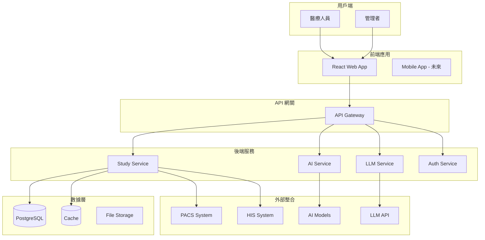
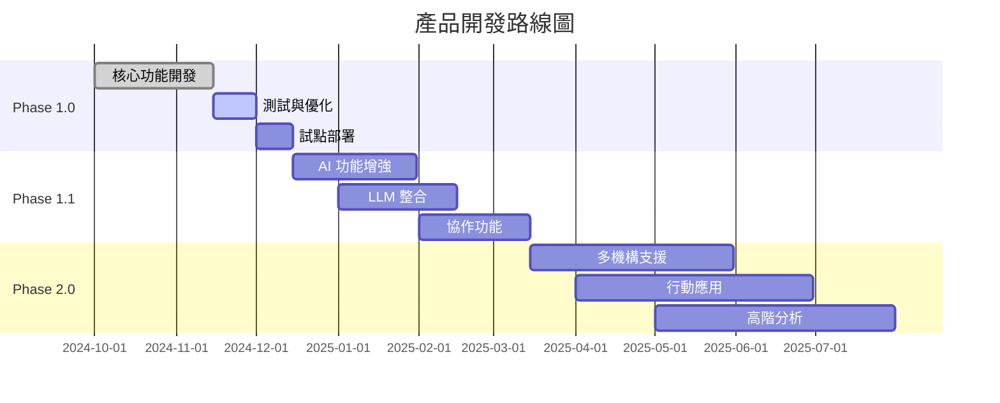

# 醫療影像智能管理平台 PRD
## Product Requirements Document v1.0

---

## 文件資訊

| 項目 | 內容 |
|------|------|
| **文件版本** | v1.0.0 |
| **發布日期** | 2024-11-12 |
| **文件狀態** | Draft |
| **負責人** | 產品團隊 |
| **審核人** | 技術長、醫療顧問 |
| **下次審查** | 2024-12-01 |

### 版本歷史

| 版本 | 日期 | 作者 | 變更說明 |
|------|------|------|---------|
| v1.0.0 | 2024-11-12 | 系統架構師 | 初始版本，基礎功能定義 |
| v1.1.0 | (預計) | - | AI 模型整合擴充 |
| v1.2.0 | (預計) | - | LLM 對話功能增強 |
| v2.0.0 | (預計) | - | 多機構協作功能 |

---

## 執行摘要

### 產品願景

建立一個**智能化醫療影像管理平台**，整合傳統 PACS 系統與現代 AI 技術，提供醫療專業人員高效的影像診斷輔助工具。平台將醫學影像、文字病歷、AI 分析結果與大型語言模型（LLM）智能問答整合於統一介面，大幅提升診斷效率與準確性。

### 核心價值主張

1. **整合性**：將分散的醫療資料整合於單一平台
2. **智能化**：AI 輔助診斷，減少人為疏失
3. **效率化**：快速搜尋與智能分析，節省 60% 查閱時間
4. **知識化**：LLM 提供即時醫學知識支援
5. **可擴展**：模組化架構，支援未來功能擴充

### 目標用戶

| 用戶類型 | 主要需求 | 使用頻率 |
|---------|---------|---------|
| **行政人員** | 協助查閱報告、批量分析、數據匯出 | 每日高頻 |
| **臨床醫師、放射科醫師** | 查閱報告、比對歷史影像 | 每日中頻 |
| **醫學研究員** | 批量分析、數據匯出 | 每週低頻 |
| **醫院管理者** | 統計報表、品質監控 | 每月低頻 |

### 成功指標

| 指標類型 | KPI | 目標值 | 測量方式 |
|---------|-----|--------|---------|
| **效率指標** | 平均診斷時間 | 降低 40% | 系統日誌 |
| **品質指標** | AI 輔助準確率 | >90% | 人工驗證 |
| **使用指標** | 日活躍用戶 | >80% | 登入統計 |
| **滿意度** | NPS 分數 | >70 | 季度調查 |
| **系統指標** | 回應時間 | <200ms | APM 監控 |

---

## 產品範圍

### Phase 1.0 範圍（當前）

#### 核心功能
1. **Study 管理與搜尋**
   - 多條件篩選搜尋
   - 分頁瀏覽
   - 批量匯出

2. **文字病歷整合**
   - 病歷關聯顯示
   - 全文搜尋
   - 版本追蹤

3. **AI 模型結果展示**
   - 辨識結果視覺化
   - 信心分數顯示
   - 異常標記

4. **基礎 LLM 問答**
   - Study 相關問題回答
   - 醫學知識查詢
   - 結果儲存管理

5. **個人化設定**
   - 介面偏好設定
   - 快速篩選器
   - 常用查詢儲存

### Phase 1.1 擴充（計劃中）

#### 新增功能
1. **進階 AI 整合**
   - 多模型比對
   - 自訂模型上傳
   - 模型效能追蹤

2. **協作功能**
   - 標註共享

3. **報表系統**
   - 自動報告生成
   - 統計分析
   - 品質指標追蹤

### Phase 2.0 願景（未來）

#### 轉型功能
1. **多機構協作平台**
4. **研究數據市集**

---

## 系統架構概覽

### 技術堆疊

```yaml
前端層:
  框架: React 18 + TypeScript
  UI庫: Ant Design 5
  狀態管理: Zustand
  路由: React Router 6

後端層:
  框架: Django 4.2 + Django Ninja
  資料庫: PostgreSQL 17
  快取: Redis / Supabase (遷移中)
  API: RESTful + GraphQL (計劃)

AI/ML層:
  推論引擎: pytorch
  模型管理: MLflow
  LLM整合: OpenAI API / Local LLaMA

基礎設施:
  容器化: Docker
  編排: Kubernetes
  監控: Prometheus + Grafana
  日誌: ELK Stack
```

### 系統互動圖



---

## 關鍵功能優先級

### MoSCoW 分析

#### Must Have（必要）
- ✅ Study 搜尋與檢視
- ✅ 文字病歷關聯
- ✅ 基本 AI 結果展示
- ✅ 用戶認證與授權
- ✅ 資料匯出功能

#### Should Have（應該）
- 🔄 LLM 智能問答
- 🔄 個人化儀表板
- 🔄 批量操作
- ⏳ 進階篩選器
- ⏳ 報告模板

#### Could Have（可以）
- ⏳ 多語言支援
- ⏳ 行動裝置 App
- ⏳ 語音輸入
- ⏳ 3D 影像檢視

#### Won't Have（暫不）
- ❌ 即時協作編輯
- ❌ 區塊鏈整合
- ❌ AR/VR 檢視

---

## 風險與緩解策略

| 風險類型 | 風險描述 | 可能性 | 影響 | 緩解策略 |
|---------|---------|--------|------|---------|
| **技術風險** | AI 模型準確度不足 | 中 | 高 | 多模型驗證、人工審核機制 |
| **法規風險** | HIPAA/GDPR 合規 | 低 | 極高 | 加密存儲、審計日誌、定期稽核 |
| **整合風險** | PACS 系統相容性 | 中 | 中 | 標準協議支援、適配器模式 |
| **使用者風險** | 醫師接受度低 | 中 | 高 | 漸進式導入、培訓計劃 |
| **效能風險** | 大量資料處理緩慢 | 高 | 中 | 快取策略、非同步處理 |

---

## 成功標準

### 第一階段成功標準（3個月）
- [ ] 完成核心功能開發
- [ ] 10 位醫師試用回饋
- [ ] 系統穩定性 >99%
- [ ] 平均回應時間 <500ms

### 第二階段成功標準（6個月）
- [ ] 100+ 活躍用戶
- [ ] AI 準確率 >85%
- [ ] 用戶滿意度 >4.0/5.0
- [ ] 零重大安全事件

### 長期成功標準（12個月）
- [ ] 成為機構標準工具
- [ ] ROI 證明 >200%
- [ ] 擴展至 3+ 部門
- [ ] 獲得醫療認證

---

## 開發時程



---

## 附錄

### A. 術語表
- **Study**: 醫學檢查項目
- **PACS**: Picture Archiving and Communication System
- **HIS**: Hospital Information System
- **DICOM**: Digital Imaging and Communications in Medicine
- **LLM**: Large Language Model

### B. 參考資料
- DICOM 標準規範
- HIPAA 合規指南
- 醫療 AI 最佳實踐

### C. 聯絡資訊
- 產品經理：[待定]
- 技術負責：[待定]
- 醫療顧問：[待定]

---

*本文件為動態文件，將根據產品發展持續更新*
*最後更新：2024-11-12*