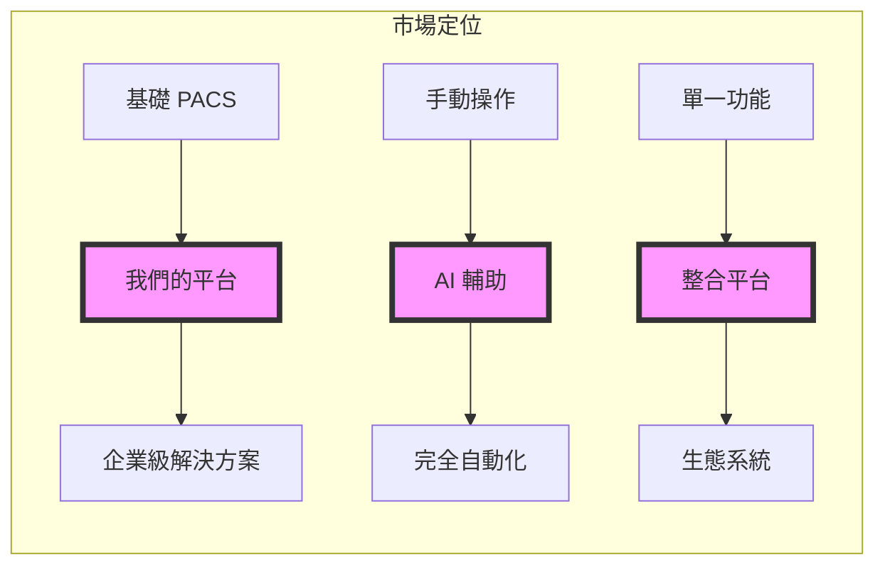
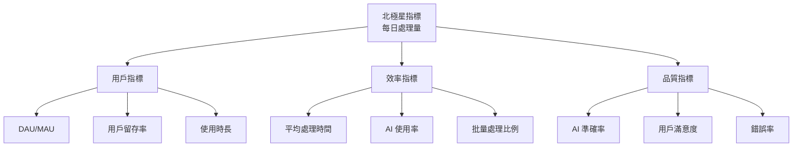
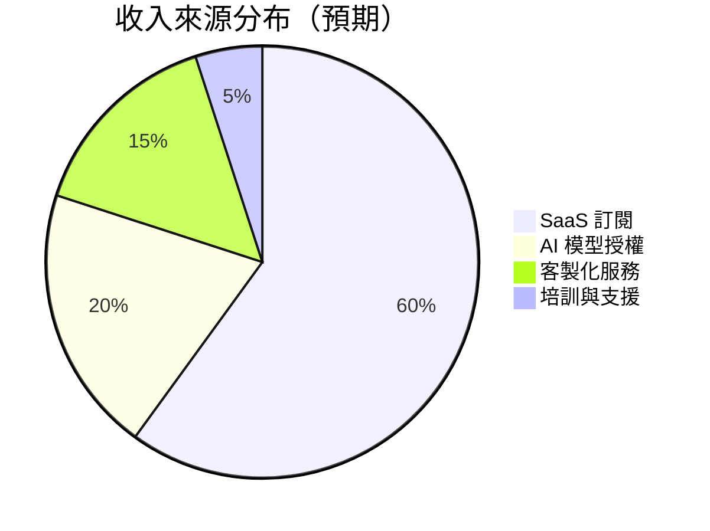

# 產品願景與目標

## 產品願景陳述

### 願景宣言
> 「打造醫療影像檢索的智能助手，讓每位醫療專業人員都能擁有 AI 驅動的第二雙眼睛，提升檢索資料準確性與速度，加速研究進程，最終提升研究品質。」

### 使命陳述
我們致力於：
- **簡化**複雜的醫療影像管理流程
- **增強**醫師的檢索能力
- **加速**從上萬檢查找到目標樣本的時間
- **提升**研究的整體品質
- **推動**醫療 AI 的實際應用

---

## 戰略目標

### 短期目標（0-6個月）

| 目標 | 具體指標 | 達成條件 | 負責團隊 |
|------|---------|---------|---------|
| **產品上線** | 系統部署完成 | Beta 版本發布 | 開發團隊 |
| **用戶採用** | 2~10活躍用戶 | 每日登入使用 | 產品團隊 |
| **功能完整** | 核心功能 100% | 通過 UAT 測試 | QA 團隊 |
| **穩定運行** | 可用性 >99% | 無重大故障 | DevOps |
| **初步整合** | 2 個 AI 模型 | 成功整合運行 | AI 團隊 |

### 中期目標（6-12個月）

| 目標 | 具體指標 | 達成條件 | 負責團隊 |
|------|---------|---------|---------|
| **規模擴展** | 500+ 用戶 | 跨部門使用 | 業務團隊 |
| **AI 成熟度** | 5+ AI 模型 | 準確率 >90% | AI 團隊 |
| **LLM 整合** | 完整問答系統 | 即時回應 | 研發團隊 |
| **效率提升** | 診斷時間 -40% | 實測數據 | 分析團隊 |
| **合規認證** | ISO/HIPAA | 通過審核 | 法規團隊 |

### 長期目標（12-24個月）

| 目標 | 具體指標 | 達成條件 | 負責團隊 |
|------|---------|---------|---------|
| **市場領導** | 3+ 機構採用 | 簽約部署 | 銷售團隊 |
| **平台生態** | 10+ 第三方整合 | API 生態系 | 平台團隊 |
| **智能化** | 自動診斷建議 | 臨床驗證 | 醫療團隊 |
| **國際化** | 多語言支援 | 3+ 語言版本 | 國際團隊 |
| **收益模型** | 訂閱制上線 | 正向現金流 | 財務團隊 |

---

## 產品定位

### 市場定位矩陣



### 競爭優勢

| 維度 | 我們的優勢 | 競爭對手劣勢 |
|------|-----------|-------------|
| **整合性** | 統一平台整合所有資料 | 多系統分散、資料孤島 |
| **智能化** | AI+LLM 雙重智能 | 僅有基礎 AI 或無 AI |
| **易用性** | 直覺介面、零學習曲線 | 複雜介面、需要培訓 |
| **擴展性** | 模組化、API 開放 | 封閉系統、客製困難 |
| **成本效益** | SaaS 訂閱、按需付費 | 高額授權、維護成本 |

---

## 用戶價值主張

### 核心價值創造

#### 1. 對臨床醫師、放射科醫師
```yaml
痛點:
  - 等待報告時間長
  - 歷史資料查找困難
  - 跨科溝通不便

價值:
  - 即時查看初步結果
  - 一鍵調閱歷史影像
  - 整合病歷完整檢視

成果:
  - 資訊完整度提升
```

---

## 成功指標體系

### 北極星指標
**每日診斷影像處理量** - 衡量平台核心價值創造

### 關鍵指標樹



### 具體指標定義

| 指標類別 | 指標名稱 | 計算方式 | 目標值 | 監測頻率 |
|---------|---------|---------|--------|---------|
| **活躍度** | DAU | 每日唯一登入用戶 | >100 | 每日 |
| **活躍度** | MAU | 每月唯一登入用戶 | >500 | 每月 |
| **留存** | 次日留存 | D1 返回用戶/D0 新用戶 | >80% | 每日 |
| **留存** | 7日留存 | D7 返回用戶/D0 新用戶 | >60% | 每週 |
| **效率** | 平均處理時間 | 總處理時間/處理數量 | <3分鐘 | 每日 |
| **效率** | AI 使用率 | AI 輔助診斷/總診斷 | >70% | 每週 |
| **品質** | AI 準確率 | 正確預測/總預測 | >90% | 每月 |
| **品質** | NPS | 推薦者-貶低者 | >70 | 每季 |
| **系統** | 可用性 | 正常運行時間/總時間 | >99.9% | 即時 |
| **系統** | 回應時間 | API 平均回應時間 | <200ms | 即時 |

---

## 產品原則

### 設計原則

1. **醫療優先（Medical First）**
   - 所有決策以病人隱私、醫療安全為首要考量
   - 不犧牲準確性追求速度
   - 保守處理不確定情況

2. **簡約至上（Simplicity）**
   - 介面直觀，無需說明書
   - 最常用功能一鍵可達
   - 減少認知負擔

3. **可解釋性（Explainability）**
   - AI 決策過程透明
   - 提供判斷依據
   - 可追溯決策路徑

4. **隱私保護（Privacy by Design）**
   - 資料最小化原則
   - 端到端加密
   - 完整審計軌跡

5. **持續改進（Continuous Improvement）**
   - 從用戶回饋學習
   - A/B 測試驅動優化
   - 快速迭代更新

### 技術原則

1. **模組化架構**
   - 微服務設計
   - 低耦合高內聚
   - 獨立部署更新

2. **API 優先**
   - RESTful 標準
   - 完整文檔
   - 版本控制

4. **資料驅動**
   - 決策基於數據
   - 完整監控指標
   - 實驗文化

---

## 風險與機會

### SWOT 分析

#### Strengths（優勢）
- ✅ 技術團隊經驗豐富
- ✅ AI 技術領先
- ✅ 醫療領域深度理解
- ✅ 靈活的產品架構

#### Weaknesses（劣勢）
- ⚠️ 品牌知名度低
- ⚠️ 資源相對有限
- ⚠️ 醫療認證缺乏
- ⚠️ 銷售通路待建立

#### Opportunities（機會）
- 🎯 醫療 AI 市場快速成長
- 🎯 政策支持智慧醫療
- 🎯 COVID 後數位轉型加速
- 🎯 跨國市場潛力大

#### Threats（威脅）
- ⛔ 大廠進入競爭
- ⛔ 法規變化風險
- ⛔ 資料安全要求提高
- ⛔ 醫師接受度不確定

### 風險緩解策略

| 風險類型 | 具體風險 | 緩解措施 | 應急計劃 |
|---------|---------|---------|---------|
| **市場風險** | 競爭加劇 | 差異化定位、快速創新 | 策略合作、併購 |
| **技術風險** | AI 模型失準 | 多模型驗證、人工審核 | 降級到輔助模式 |
| **法規風險** | 合規要求變化 | 提前準備、專家諮詢 | 快速調整架構 |
| **營運風險** | 關鍵人才流失 | 股權激勵、知識管理 | 外部顧問支援 |

---

## 商業模式

### 收入模式



### 定價策略

| 版本 | 目標客戶 | 功能範圍 | 定價 |
|------|---------|---------|------|
| **基礎版** | 小型診所 | 核心功能 | $299/月 |
| **專業版** | 中型醫院 | 全功能+5個AI | $999/月 |
| **企業版** | 大型醫療集團 | 無限制+客製 | 客製報價 |
| **研究版** | 學術機構 | 特殊優惠 | $99/月 |

### 成長策略

1. **產品主導成長（PLG）**
   - 免費試用 30 天
   - 病毒式推薦機制
   - 社群口碑行銷

2. **夥伴關係**
   - PACS 廠商整合
   - AI 公司合作
   - 醫療集團結盟

3. **地理擴展**
   - 台灣 → 亞洲 → 全球
   - 在地化策略
   - 合規先行

---

## 里程碑與檢查點

### Q4 2024
- [x] 完成 MVP 開發
- [x] 內部測試完成
- [ ] Beta 版本發布
- [ ] 10 位醫師測試

### Q1 2025
- [ ] 正式版發布
- [ ] 50+ 付費用戶
- [ ] 3 個 AI 模型整合
- [ ] HIPAA 合規認證

### Q2 2025
- [ ] LLM 功能上線
- [ ] 100+ 付費用戶
- [ ] 第一家醫院合約
- [ ] 手機 App 發布

### Q3 2025
- [ ] 國際化版本
- [ ] 500+ 付費用戶
- [ ] 5+ 機構客戶
- [ ] Series A 募資

---

*本章節定義產品的長期願景與階段性目標，為產品發展提供明確方向*