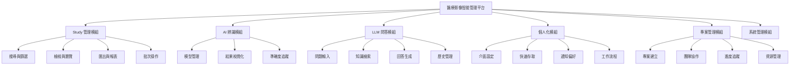
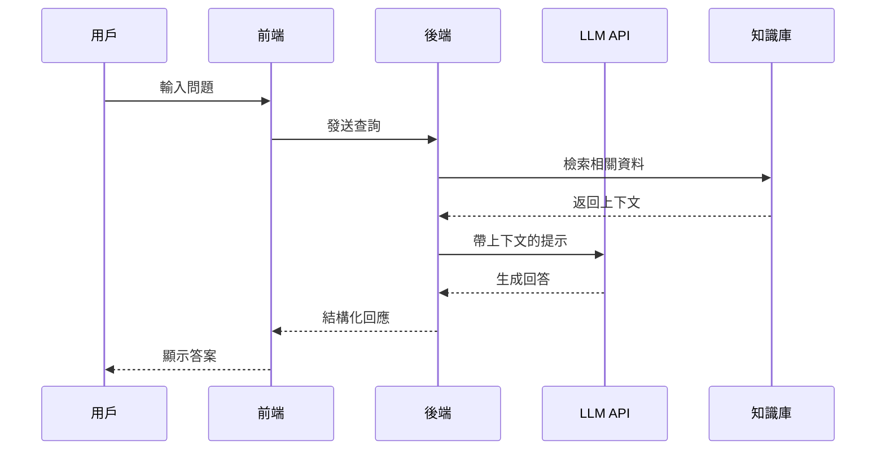

# 核心功能與需求規格

## 功能架構圖



---

## Module 1: Study 管理模組

### 1.1 搜尋與篩選功能

#### 功能描述
提供強大的多條件搜尋與智能篩選功能，讓醫師快速定位所需的醫學檢查資料。

#### 詳細需求

| 需求 ID | 需求描述 | 優先級 | 驗收條件 |
|---------|---------|--------|---------|
| STD-001 | 支援關鍵字全文搜尋 | P0 | 可搜尋所有文字欄位 |
| STD-002 | 多條件組合篩選 | P0 | 支援 AND/OR 邏輯 |
| STD-003 | 日期範圍篩選 | P0 | 支援相對/絕對日期 |
| STD-004 | 智能搜尋建議 | P1 | 即時顯示建議結果 |
| STD-005 | 搜尋歷史記錄 | P1 | 保存最近 20 筆 |
| STD-006 | 進階搜尋語法 | P2 | 支援正則表達式 |
| STD-007 | 全文搜尋 | P2 | 支持文字報告全文檢索 |


#### 用戶故事
```
作為一名放射科醫師，
我希望能夠透過病患姓名、檢查類型、日期等多個條件快速搜尋，
以便在緊急情況下迅速找到需要的影像資料。
```

#### 介面原型

```
┌─────────────────────────────────────────────┐
│ 🔍 搜尋 Studies                              │
├─────────────────────────────────────────────┤
│                                             │
│ [關鍵字搜尋________________] [🔍]           │
│                                             │
│ 進階篩選 ▼                                  │
│ ┌─────────────────────────────────────┐   │
│ │ 檢查狀態：[全部 ▼]                   │   │
│ │ 檢查來源：[全部 ▼]                   │   │
│ │ 日期範圍：[____] 至 [____]          │   │
│ │ 病患性別：☐ 男 ☐ 女 ☐ 不限         │   │
│ │ 年齡範圍：[__] - [__] 歲            │   │
│ └─────────────────────────────────────┘   │
│                                             │
│ [套用篩選] [重設] [儲存篩選條件]           │
└─────────────────────────────────────────────┘
```

### 1.2 檢視與瀏覽功能

#### 功能描述
提供直觀的 Study 列表檢視和詳細資訊瀏覽功能。

#### 詳細需求

| 需求 ID | 需求描述 | 優先級 | 驗收條件 |
|---------|---------|--------|---------|
| VIW-001 | 列表/卡片視圖切換 | P0 | 一鍵切換視圖 |
| VIW-002 | 分頁載入 | P0 | 每頁 20/50/100 筆 |
| VIW-003 | 欄位自訂顯示 | P1 | 可選顯示欄位 |
| VIW-004 | 快速預覽 | P1 | Hover 顯示摘要 |
| VIW-005 | 無限滾動 | P2 | 自動載入更多 |
| VIW-006 | 縮圖顯示 | P2 | 顯示影像縮圖 |

---

## Module 2: AI 診斷模組

### 2.1 模型管理

#### 功能描述
管理和配置各種 AI 診斷模型，包括模型的載入、版本控制和參數設定。

#### 詳細需求

| 需求 ID | 需求描述 | 優先級 | 驗收條件 |
|---------|---------|--------|---------|
| AIM-001 | 模型列表管理 | P0 | CRUD 操作完整 |
| AIM-002 | 模型版本控制 | P0 | 支援多版本並存 |
| AIM-003 | 模型參數配置 | P1 | 可調整閾值參數 |
| AIM-004 | 模型效能監控 | P1 | 即時顯示指標 |
| AIM-005 | 模型 A/B 測試 | P2 | 支援對比測試 |
| AIM-006 | 自訂模型上傳 | P2 | 支援 ONNX 格式 |

#### AI 模型規格

```yaml
支援的模型類型:
  - 肺部結節偵測
  - 骨折識別
  - 腫瘤分類
  - 血管異常檢測
  - 器官分割

輸入格式:
  - DICOM
  - NIfTI
  - PNG/JPG

輸出格式:
  - JSON (座標、分類、信心分數)
  - Overlay 影像
  - 結構化報告

效能要求:
  - 推論時間: <5秒
  - 準確率: >90%
  - GPU 記憶體: <8GB
```

### 2.2 結果視覺化

#### 功能描述
將 AI 分析結果以視覺化方式呈現，包括標記、熱圖和 3D 重建。

#### 視覺化元件

| 元件類型 | 用途 | 互動功能 | 輸出格式 |
|---------|------|---------|---------|
| **邊界框** | 標示異常區域 | 可調整大小 | SVG/Canvas |
| **熱力圖** | 顯示可能性分布 | 調整透明度 | Canvas |
| **分割遮罩** | 器官/病變分割 | 顯示/隱藏 | WebGL |
| **3D 模型** | 立體檢視 | 旋轉/縮放 | Three.js |
| **標註工具** | 人工標記 | 繪製/編輯 | JSON |

---

## Module 3: LLM 問答模組

### 3.1 智能問答系統

#### 功能描述
整合大型語言模型，提供醫學知識問答和 Study 相關查詢功能。

#### 詳細需求

| 需求 ID | 需求描述 | 優先級 | 驗收條件 |
|---------|---------|--------|---------|
| LLM-001 | 自然語言輸入 | P0 | 支援中英文 |
| LLM-002 | 上下文理解 | P0 | 記憶對話歷史 |
| LLM-003 | 醫學術語識別 | P1 | 準確識別 ICD-10 |
| LLM-004 | 引用來源標註 | P1 | 提供參考文獻 |
| LLM-005 | 多輪對話 | P1 | 支援追問 |
| LLM-006 | 語音輸入 | P2 | 支援語音轉文字 |

#### LLM 整合架構



### 3.2 提示工程模板

```python
# 系統提示詞模板
SYSTEM_PROMPT = """
你是一位專業的醫學影像診斷助手，具備以下能力：
1. 解釋醫學影像發現
2. 提供診斷建議
3. 回答醫學相關問題
4. 引用相關醫學文獻

回答規則：
- 使用專業醫學術語
- 提供證據支持
- 標註不確定性
- 建議人工複核
"""

# Study 相關查詢模板
STUDY_QUERY_TEMPLATE = """
Study 資訊：
- 檢查類型：{exam_type}
- 病患資訊：{patient_info}
- 臨床病史：{clinical_history}

AI 分析結果：
{ai_results}

問題：{user_question}

請基於以上資訊提供專業分析。
"""
```

---

## Module 4: 個人化設定模組

### 4.1 用戶偏好設定

#### 功能描述
允許用戶自訂介面、功能和通知偏好。

#### 設定項目

| 類別 | 設定項 | 選項 | 預設值 |
|------|--------|------|--------|
| **介面** | 主題色彩 | 淺色/深色/自動 | 自動 |
| **介面** | 語言 | 繁中/簡中/英文 | 繁中 |
| **介面** | 字體大小 | 小/中/大 | 中 |
| **顯示** | 預設視圖 | 列表/卡片/縮圖 | 列表 |
| **顯示** | 每頁筆數 | 20/50/100 | 20 |
| **通知** | 郵件通知 | 開/關 | 開 |
| **通知** | 推播通知 | 開/關 | 關 |
| **工作流** | 快捷鍵 | 自訂組合鍵 | 預設 |

### 4.2 智能推薦

#### 功能描述
基於用戶行為提供個人化推薦。

#### 推薦引擎

```python
class RecommendationEngine:
    """
    個人化推薦引擎
    """

    def get_recommendations(self, user_id):
        return {
            "frequently_used_filters": self.get_frequent_filters(user_id),
            "suggested_studies": self.get_similar_studies(user_id),
            "relevant_ai_models": self.get_relevant_models(user_id),
            "trending_topics": self.get_trending_topics(),
            "shortcuts": self.get_personalized_shortcuts(user_id)
        }
```

---

## Module 5: 專案管理模組

### 5.1 專案組織

#### 功能描述
支援將 Studies 組織成專案，便於團隊協作和進度追蹤。

#### 專案結構

```
專案
├── 基本資訊
│   ├── 專案名稱
│   ├── 描述
│   ├── 建立日期
│   └── 狀態
├── 團隊成員
│   ├── 負責人
│   ├── 協作者
│   └── 觀察者
├── Studies
│   ├── 已關聯 Studies
│   ├── 標籤分類
│   └── 自訂群組
├── AI 分析
│   ├── 批次處理任務
│   ├── 模型配置
│   └── 結果彙總
└── 文檔
    ├── 報告
    ├── 筆記
    └── 附件
```

### 5.2 協作功能

#### 功能需求

| 需求 ID | 需求描述 | 優先級 | 驗收條件 |
|---------|---------|--------|---------|
| PRJ-001 | 專案建立與管理 | P0 | CRUD 完整 |
| PRJ-002 | 成員權限控制 | P0 | RBAC 實作 |
| PRJ-003 | 評論與討論 | P1 | 即時更新 |
| PRJ-004 | 版本控制 | P1 | 變更歷史 |
| PRJ-005 | 任務指派 | P2 | 工作流程 |
| PRJ-006 | 通知提醒 | P2 | 多通道推送 |
| PRJ-007 | 導入資料 | P0 | 可以支援醫院表格匯入建立對應 |
---

## 非功能性需求

### 效能需求

| 指標 | 要求 | 測量方式 |
|------|------|----------|
| **回應時間** | P95 < 200ms | APM 監控 |
| **頁面載入** | < 3 秒 | Lighthouse |
| **並發用戶** | 1000+ | 壓力測試 |
| **可用性** | 99.9% | 監控系統 |
| **資料處理** | 10GB/天 | 日誌分析 |

### 安全需求

| 類別 | 要求 | 實作方式 |
|------|------|----------|
| **認證** | 多因素認證 | OAuth 2.0 + MFA |
| **授權** | 角色權限 | RBAC + ABAC |
| **加密** | 端到端加密 | TLS 1.3 + AES-256 |
| **審計** | 完整日誌 | ELK Stack |
| **合規** | HIPAA/GDPR | 定期稽核 |

### 可用性需求

| 需求 | 規格 | 驗證方法 |
|------|------|----------|
| **學習曲線** | < 30 分鐘上手 | 用戶測試 |
| **錯誤率** | < 5% | 可用性測試 |
| **滿意度** | > 4.0/5.0 | 問卷調查 |
| **無障礙** | WCAG 2.1 AA | 自動檢測 |
| **多語言** | 3+ 語言 | i18n 支援 |

---

## 技術限制與約束

### 技術約束

| 約束類型 | 具體限制 | 影響範圍 |
|---------|---------|---------|
| **瀏覽器** | Chrome 90+, Firefox 88+, Safari 14+ | 前端功能 |
| **網路** | 最低 10 Mbps | 影像載入 |
| **儲存** | 單檔 < 500MB | 檔案上傳 |
| **API** | 請求 < 10MB | 資料傳輸 |
| **Session** | 24 小時逾時 | 用戶體驗 |

### 整合限制

| 系統 | 協議 | 版本要求 | 備註 |
|------|------|---------|------|
| **PACS** | DICOM | 3.0+ | 必要 |
| **HIS** | HL7 | 2.5+ | 可選 |
| **LIS** | FHIR | R4 | 可選 |
| **RIS** | REST | - | 可選 |

---

## 驗收標準

### 功能驗收

```yaml
Study 管理模組:
  搜尋功能:
    - 關鍵字搜尋準確率 > 95%
    - 篩選回應時間 < 500ms
    - 結果相關性評分 > 0.8

AI 診斷模組:
  模型推論:
    - 準確率 > 90%
    - 召回率 > 85%
    - F1 分數 > 0.87

LLM 問答模組:
  回答品質:
    - 相關性評分 > 4.0/5.0
    - 回應時間 < 3秒
    - 引用準確率 > 90%

個人化模組:
  推薦效果:
    - 點擊率 > 30%
    - 使用率提升 > 20%
    - 滿意度 > 4.0/5.0
```

### 系統驗收

- [ ] 所有 P0 功能 100% 完成
- [ ] 單元測試覆蓋率 > 80%
- [ ] 整合測試通過率 100%
- [ ] 壓力測試達標
- [ ] 安全掃描無高危漏洞
- [ ] 用戶驗收測試通過

---

*本章節定義所有核心功能的詳細需求，作為開發實作的依據*