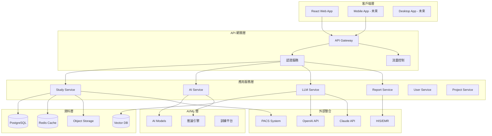
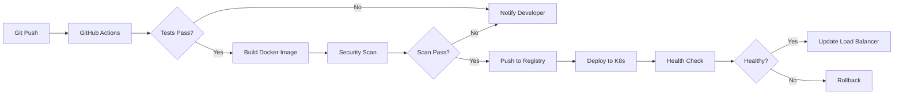

# 技術架構規範

## 系統架構總覽

### 架構原則
1. **微服務架構**：模組化設計，服務間低耦合
2. **API 優先**：前後端分離，RESTful + GraphQL (未來)
3. **雲原生設計**：容器化部署，彈性擴展
4. **事件驅動**：非同步處理，提升回應速度
5. **安全第一**：多層防護，零信任架構

### 系統架構圖



---

## 技術堆疊詳細規範

### 前端技術架構

#### 核心框架
| 技術 | 版本 | 用途 | 理由 |
|------|------|------|------|
| **React** | 18.x | 前端框架 | 生態系完整、社群活躍 |
| **TypeScript** | 5.x | 類型系統 | 提升代碼品質、降低錯誤 |
| **Vite** | 5.x | 構建工具 | 快速熱更新、優化構建 |
| **React Router** | 6.x | 路由管理 | 聲明式路由、懶加載 |

#### UI 組件庫
| 技術 | 版本 | 用途 | 理由 |
|------|------|------|------|
| **Ant Design** | 5.x | UI 組件庫 | 醫療級專業介面 |
| **Tailwind CSS** | 3.x | 原子化 CSS | 快速樣式開發 |
| **Recharts** | 2.x | 圖表庫 | 數據視覺化 |
| **Cornerstone.js** | 2.x | DICOM 檢視器 | 醫療影像顯示 |

#### 狀態管理
| 技術 | 版本 | 用途 | 理由 |
|------|------|------|------|
| **Zustand** | 4.x | 全域狀態 | 輕量級、TypeScript 友好 |
| **React Query** | 5.x | 伺服器狀態 | 快取、同步、樂觀更新 |
| **Jotai** | 2.x | 原子化狀態 | 細粒度響應式 |

### 後端技術架構

#### 核心框架
| 技術 | 版本 | 用途 | 理由 |
|------|------|------|------|
| **Django** | 4.2 LTS | 後端框架 | 成熟穩定、醫療合規 |
| **Django Ninja** | 1.x | API 框架 | 高性能、類型安全 |
| **Celery** | 5.x | 非同步任務 | 背景處理、定時任務 |
| **Channels** | 4.x | WebSocket | 即時通訊、推送 |

#### 資料庫層
| 技術 | 版本 | 用途 | 理由 |
|------|------|------|------|
| **PostgreSQL** | 15.x | 主資料庫 | ACID、JSON 支援 |
| **Redis** | 7.x | 快取/隊列 | 高性能、發布訂閱 |
| **Supabase** | - | 備選方案 | 整合服務、即時同步 |
| **Pinecone** | - | 向量資料庫 | AI 嵌入儲存 |

#### AI/ML 基礎設施
| 技術 | 版本 | 用途 | 理由 |
|------|------|------|------|
| **TensorFlow Serving** | 2.x | 模型服務 | 生產級推論 |
| **ONNX Runtime** | 1.x | 跨框架推論 | 模型互通性 |
| **MLflow** | 2.x | 模型管理 | 版本控制、部署 |
| **Triton** | - | GPU 推論 | 高吞吐量 |

### DevOps 與部署

#### 容器化與編排
| 技術 | 版本 | 用途 | 理由 |
|------|------|------|------|
| **Docker** | 24.x | 容器化 | 環境一致性 |
| **Kubernetes** | 1.28 | 容器編排 | 自動擴展、高可用 |
| **Helm** | 3.x | K8s 包管理 | 部署管理 |
| **Istio** | 1.19 | 服務網格 | 流量管理、安全 |

#### CI/CD 管道
| 技術 | 用途 | 配置 |
|------|------|------|
| **GitHub Actions** | CI/CD | 自動測試、部署 |
| **ArgoCD** | GitOps | 聲明式部署 |
| **SonarQube** | 代碼品質 | 靜態分析 |
| **Trivy** | 安全掃描 | 漏洞檢測 |

#### 監控與日誌
| 技術 | 用途 | 指標 |
|------|------|------|
| **Prometheus** | 指標收集 | CPU、記憶體、回應時間 |
| **Grafana** | 視覺化 | 儀表板、警報 |
| **ELK Stack** | 日誌管理 | 集中日誌、分析 |
| **Jaeger** | 分散式追蹤 | 請求鏈路 |

---

## API 設計規範

### RESTful API 標準

#### URL 結構
```
https://api.medical-platform.com/v1/{resource}/{id}/{sub-resource}
```

#### HTTP 動詞使用
| 動詞 | 操作 | 範例 |
|------|------|------|
| **GET** | 讀取資源 | GET /studies/123 |
| **POST** | 創建資源 | POST /studies |
| **PUT** | 完整更新 | PUT /studies/123 |
| **PATCH** | 部分更新 | PATCH /studies/123 |
| **DELETE** | 刪除資源 | DELETE /studies/123 |

#### 狀態碼規範
| 狀態碼 | 含義 | 使用場景 |
|--------|------|----------|
| **200** | 成功 | GET、PUT、PATCH 成功 |
| **201** | 已創建 | POST 成功創建資源 |
| **204** | 無內容 | DELETE 成功 |
| **400** | 錯誤請求 | 參數錯誤、驗證失敗 |
| **401** | 未認證 | 需要登入 |
| **403** | 無權限 | 權限不足 |
| **404** | 找不到 | 資源不存在 |
| **429** | 太多請求 | 流量限制 |
| **500** | 伺服器錯誤 | 內部錯誤 |

### API 版本控制

```yaml
版本策略:
  方式: URL 版本控制
  格式: /v{major}
  範例: /v1/studies, /v2/studies

向後相容:
  minor_changes: 不改變 URL
  major_changes: 新版本 API
  deprecation: 6 個月通知期
  sunset: 12 個月後移除
```

### API 文檔

#### OpenAPI 3.0 規範
```yaml
openapi: 3.0.0
info:
  title: Medical Platform API
  version: 1.0.0
  description: 醫療影像智能管理平台 API

paths:
  /studies:
    get:
      summary: 獲取 Study 列表
      parameters:
        - name: patient_id
          in: query
          required: false
          schema:
            type: string
        - name: date_from
          in: query
          required: false
          schema:
            type: string
            format: date
      responses:
        200:
          description: 成功
          content:
            application/json:
              schema:
                type: array
                items:
                  $ref: '#/components/schemas/Study'
```

---

## 資料架構設計

### 資料庫架構

#### 核心資料表
```sql
-- Study 表（醫學檢查）
CREATE TABLE studies (
    id UUID PRIMARY KEY DEFAULT gen_random_uuid(),
    patient_id VARCHAR(50) NOT NULL,
    study_instance_uid VARCHAR(128) UNIQUE NOT NULL,
    study_date DATE NOT NULL,
    modality VARCHAR(16),
    description TEXT,
    series_count INTEGER DEFAULT 0,
    instance_count INTEGER DEFAULT 0,
    metadata JSONB,
    created_at TIMESTAMP WITH TIME ZONE DEFAULT CURRENT_TIMESTAMP,
    updated_at TIMESTAMP WITH TIME ZONE DEFAULT CURRENT_TIMESTAMP,
    INDEX idx_patient_id (patient_id),
    INDEX idx_study_date (study_date),
    INDEX idx_modality (modality)
);

-- Report 表（診斷報告）
CREATE TABLE reports (
    id UUID PRIMARY KEY DEFAULT gen_random_uuid(),
    study_id UUID REFERENCES studies(id) ON DELETE CASCADE,
    version INTEGER DEFAULT 1,
    content TEXT NOT NULL,
    findings JSONB,
    impression TEXT,
    recommendations TEXT,
    status VARCHAR(20) DEFAULT 'draft',
    author_id UUID REFERENCES users(id),
    reviewed_by UUID REFERENCES users(id),
    created_at TIMESTAMP WITH TIME ZONE DEFAULT CURRENT_TIMESTAMP,
    updated_at TIMESTAMP WITH TIME ZONE DEFAULT CURRENT_TIMESTAMP,
    INDEX idx_study_id (study_id),
    INDEX idx_status (status),
    INDEX idx_author (author_id)
);

-- AI Results 表（AI 辨識結果）
CREATE TABLE ai_results (
    id UUID PRIMARY KEY DEFAULT gen_random_uuid(),
    study_id UUID REFERENCES studies(id) ON DELETE CASCADE,
    model_id VARCHAR(100) NOT NULL,
    model_version VARCHAR(20) NOT NULL,
    predictions JSONB NOT NULL,
    confidence_scores JSONB,
    processing_time_ms INTEGER,
    status VARCHAR(20) DEFAULT 'completed',
    created_at TIMESTAMP WITH TIME ZONE DEFAULT CURRENT_TIMESTAMP,
    INDEX idx_study_id (study_id),
    INDEX idx_model_id (model_id),
    INDEX idx_created_at (created_at)
);

-- LLM Conversations 表（LLM 對話）
CREATE TABLE llm_conversations (
    id UUID PRIMARY KEY DEFAULT gen_random_uuid(),
    study_id UUID REFERENCES studies(id) ON DELETE CASCADE,
    user_id UUID REFERENCES users(id),
    messages JSONB[] NOT NULL,
    context JSONB,
    model_used VARCHAR(50),
    total_tokens INTEGER,
    created_at TIMESTAMP WITH TIME ZONE DEFAULT CURRENT_TIMESTAMP,
    updated_at TIMESTAMP WITH TIME ZONE DEFAULT CURRENT_TIMESTAMP,
    INDEX idx_study_user (study_id, user_id),
    INDEX idx_created_at (created_at)
);
```

### 快取策略

#### 多層快取架構
```yaml
L1_Cache:
  位置: 應用程式記憶體
  大小: 100MB
  TTL: 5 分鐘
  內容: 熱點數據、會話資料

L2_Cache:
  位置: Redis
  大小: 2GB
  TTL: 30 分鐘
  內容: Study 清單、AI 結果、用戶偏好

L3_Cache:
  位置: CDN
  大小: 無限制
  TTL: 24 小時
  內容: 靜態資源、影像縮圖

快取失效策略:
  - 主動失效: 資料更新時清除
  - 被動失效: TTL 過期
  - LRU: 記憶體不足時淘汰
```

### 資料安全

#### 加密規範
```yaml
傳輸加密:
  協議: TLS 1.3
  密碼套件: ECDHE-RSA-AES256-GCM-SHA384
  證書: Let's Encrypt / 企業證書

存儲加密:
  資料庫: AES-256 透明加密
  檔案系統: AES-256-GCM
  備份: GPG 加密

應用層加密:
  敏感欄位: AES-256-CBC
  密鑰管理: AWS KMS / HashiCorp Vault
  密碼: bcrypt (cost=12)
```

#### 存取控制
```yaml
認證方式:
  - JWT Token (主要)
  - OAuth 2.0 (SSO)
  - SAML 2.0 (企業)

授權模型:
  類型: RBAC + ABAC
  角色:
    - 系統管理員
    - 醫院管理者
    - 主治醫師
    - 住院醫師
    - 醫學生
    - 研究員

權限矩陣:
  Study:
    read: [所有角色]
    write: [主治醫師, 住院醫師]
    delete: [系統管理員, 醫院管理者]

  AI_Results:
    read: [所有角色]
    write: [系統]
    validate: [主治醫師]
```

---

## 效能優化策略

### 資料庫優化

#### 查詢優化
```sql
-- 使用覆蓋索引
CREATE INDEX idx_study_search
ON studies(patient_id, study_date, modality)
INCLUDE (description, series_count);

-- 分區表
CREATE TABLE studies_2024 PARTITION OF studies
FOR VALUES FROM ('2024-01-01') TO ('2025-01-01');

-- 物化視圖
CREATE MATERIALIZED VIEW study_statistics AS
SELECT
    DATE_TRUNC('month', study_date) as month,
    modality,
    COUNT(*) as study_count,
    AVG(instance_count) as avg_instances
FROM studies
GROUP BY 1, 2
WITH DATA;

-- 定期刷新
REFRESH MATERIALIZED VIEW CONCURRENTLY study_statistics;
```

#### 連接池配置
```yaml
PostgreSQL:
  max_connections: 200
  shared_pool_size: 100
  dedicated_pool_size: 20
  idle_timeout: 300s
  max_lifetime: 3600s

Redis:
  max_connections: 50
  pool_size: 10
  timeout: 5s
  retry_strategy: exponential_backoff
```

### API 效能

#### 回應時間目標
| API 類型 | P50 | P95 | P99 |
|---------|-----|-----|-----|
| 簡單查詢 | <50ms | <100ms | <200ms |
| 複雜查詢 | <200ms | <500ms | <1s |
| AI 推論 | <1s | <3s | <5s |
| LLM 回應 | <2s | <5s | <10s |

#### 優化技術
```yaml
分頁策略:
  方式: Cursor-based pagination
  預設大小: 20
  最大大小: 100

批量處理:
  最大批次: 100
  超時時間: 30s

壓縮:
  回應壓縮: gzip, brotli
  最小大小: 1KB
  壓縮等級: 6

併發控制:
  請求限制: 100/秒/用戶
  併發連接: 1000
  隊列大小: 5000
```

### 前端優化

#### 載入優化
```javascript
// 代碼分割
const StudyList = lazy(() => import('./components/StudyList'));
const AIResults = lazy(() => import('./components/AIResults'));

// 圖片懶加載
const LazyImage = ({ src, alt }) => {
  const [ref, inView] = useInView({
    triggerOnce: true,
    rootMargin: '200px',
  });

  return (
    <div ref={ref}>
      {inView && }
    </div>
  );
};

// 虛擬滾動
<VirtualList
  height={600}
  itemCount={studies.length}
  itemSize={80}
  width="100%"
>
  {StudyRow}
</VirtualList>
```

#### 快取策略
```javascript
// Service Worker 快取
self.addEventListener('fetch', (event) => {
  if (event.request.url.includes('/api/static/')) {
    event.respondWith(
      caches.match(event.request).then((response) => {
        return response || fetch(event.request).then((response) => {
          return caches.open('v1').then((cache) => {
            cache.put(event.request, response.clone());
            return response;
          });
        });
      })
    );
  }
});

// React Query 快取配置
const queryClient = new QueryClient({
  defaultOptions: {
    queries: {
      staleTime: 5 * 60 * 1000, // 5 分鐘
      cacheTime: 10 * 60 * 1000, // 10 分鐘
      refetchOnWindowFocus: false,
      retry: 3,
    },
  },
});
```

---

## 可擴展性設計

### 水平擴展

#### 應用層擴展
```yaml
自動擴展規則:
  指標:
    - CPU > 70%
    - Memory > 80%
    - Request Queue > 100

  擴展策略:
    最小實例: 2
    最大實例: 10
    擴展步長: 2
    冷卻時間: 300s

  負載均衡:
    算法: Round Robin
    健康檢查: /health
    權重分配: 動態調整
```

#### 資料庫擴展
```yaml
讀寫分離:
  主庫: 寫入操作
  從庫: 讀取操作 (2-3 個)
  同步: 異步複製
  延遲: <100ms

分片策略:
  分片鍵: patient_id
  分片數: 4 (初始)
  分片算法: 一致性雜湊
  再平衡: 自動
```

### 模組化架構

#### 插件系統
```python
# 插件介面定義
class AIModelPlugin(ABC):
    @abstractmethod
    def predict(self, image_data: np.ndarray) -> Dict:
        pass

    @abstractmethod
    def get_model_info(self) -> ModelInfo:
        pass

    @abstractmethod
    def validate_input(self, image_data: np.ndarray) -> bool:
        pass

# 插件註冊
class PluginRegistry:
    def register(self, plugin_name: str, plugin_class: Type[AIModelPlugin]):
        self.plugins[plugin_name] = plugin_class

    def get_plugin(self, plugin_name: str) -> AIModelPlugin:
        return self.plugins[plugin_name]()
```

#### 微服務通訊
```yaml
服務發現:
  方式: Consul / Kubernetes Service
  健康檢查: HTTP / gRPC

服務間通訊:
  同步: gRPC / REST
  非同步: RabbitMQ / Kafka

熔斷機制:
  錯誤閾值: 50%
  檢查間隔: 5s
  恢復時間: 30s

重試策略:
  最大重試: 3
  退避算法: 指數退避
  最大延遲: 10s
```

---

## 災難恢復與高可用

### 備份策略

#### 資料備份
```yaml
全量備份:
  頻率: 每日 02:00
  保留: 30 天
  位置: 異地 S3

增量備份:
  頻率: 每小時
  保留: 7 天
  位置: 本地 + S3

即時備份:
  方式: WAL 歸檔
  延遲: <1 分鐘
  位置: 異地機房
```

#### 恢復計劃
```yaml
RTO (恢復時間目標):
  系統故障: 15 分鐘
  資料損壞: 1 小時
  災難恢復: 4 小時

RPO (恢復點目標):
  交易資料: 0 (同步複製)
  影像資料: 1 小時
  日誌資料: 24 小時

演練頻率:
  小型演練: 每月
  全面演練: 每季
```

### 高可用架構

#### 多活架構
```yaml
部署模式:
  主機房: 台北
  備機房: 高雄

資料同步:
  資料庫: 雙向同步
  檔案: 異步複製
  快取: 獨立部署

流量分配:
  正常: 70% 主 / 30% 備
  故障: 100% 切換

故障切換:
  檢測時間: <10s
  切換時間: <30s
  自動回切: 支援
```

---

## 合規性與標準

### 醫療法規合規

#### HIPAA 合規
- ✅ 存取控制與審計
- ✅ 資料加密（傳輸與存儲）
- ✅ 最小權限原則
- ✅ 資料完整性檢查
- ✅ 災難恢復計劃

#### 台灣醫療法規
- ✅ 個人資料保護法
- ✅ 醫療機構電子病歷製作及管理辦法
- ✅ 醫療器材管理法（AI 模型）
- ✅ 遠距醫療相關規範

### 技術標準

#### 醫療資訊標準
| 標準 | 版本 | 用途 |
|------|------|------|
| **DICOM** | 3.0 | 醫療影像 |
| **HL7 FHIR** | R4 | 資料交換 |
| **LOINC** | 2.73 | 檢驗編碼 |
| **SNOMED CT** | 2023 | 臨床術語 |
| **ICD-10** | 2023 | 疾病分類 |

#### 資安標準
| 標準 | 合規狀態 |
|------|----------|
| **ISO 27001** | 規劃中 |
| **ISO 27799** | 規劃中 |
| **OWASP Top 10** | ✅ 已實施 |
| **CIS Controls** | ✅ 已實施 |

---

## 部署架構

### 環境配置

#### 開發環境
```yaml
infrastructure:
  compute: 2 vCPU, 4GB RAM
  database: PostgreSQL 15 (Docker)
  cache: Redis 7 (Docker)
  storage: Local filesystem

access:
  url: https://dev.medical-platform.local
  vpn: Required
  auth: Basic Auth
```

#### 測試環境
```yaml
infrastructure:
  compute: 4 vCPU, 8GB RAM
  database: PostgreSQL 15 (RDS)
  cache: Redis 7 (ElastiCache)
  storage: S3 compatible

access:
  url: https://test.medical-platform.com
  vpn: Required
  auth: OAuth 2.0
```

#### 生產環境
```yaml
infrastructure:
  compute: 8 vCPU, 16GB RAM (Auto-scaling)
  database: PostgreSQL 15 (RDS Multi-AZ)
  cache: Redis 7 (ElastiCache Cluster)
  storage: S3 + CloudFront

access:
  url: https://app.medical-platform.com
  vpn: Optional
  auth: OAuth 2.0 + MFA
```

### 部署流程

#### CI/CD Pipeline


---

## 技術債務管理

### 現有技術債務
| 項目 | 優先級 | 影響 | 解決計劃 |
|------|--------|------|----------|
| 單體架構 | 高 | 擴展受限 | Q2 2025 微服務化 |
| 缺少測試 | 高 | 品質風險 | Q1 2025 增加覆蓋率到 80% |
| 手動部署 | 中 | 效率低 | Q1 2025 實施 CI/CD |
| 舊版相依 | 低 | 安全風險 | Q3 2025 升級 |

### 技術演進路線圖

#### 2024 Q4 (當前)
- ✅ Django + PostgreSQL 基礎架構
- ✅ 基本 AI 模型整合
- ✅ React 前端框架

#### 2025 Q1
- [ ] 實施 CI/CD 流程
- [ ] 容器化部署
- [ ] 增加測試覆蓋率

#### 2025 Q2
- [ ] 微服務架構遷移
- [ ] Kubernetes 部署
- [ ] 實施服務網格

#### 2025 Q3
- [ ] 多雲部署能力
- [ ] AI 模型管理平台
- [ ] 進階監控系統

---

## 附錄：技術決策記錄

### ADR-001: 選擇 PostgreSQL 作為主資料庫
**日期**: 2024-10-01
**狀態**: 已採納
**決策**: 使用 PostgreSQL 15 作為主要資料庫
**原因**:
- ACID 合規性
- JSON 支援醫療資料
- 成熟的生態系統
- 優秀的效能

### ADR-002: 採用微服務架構
**日期**: 2024-11-01
**狀態**: 規劃中
**決策**: 逐步從單體遷移到微服務
**原因**:
- 獨立擴展能力
- 技術棧靈活性
- 故障隔離
- 團隊自主性

### ADR-003: 選擇 React 作為前端框架
**日期**: 2024-09-15
**狀態**: 已實施
**決策**: 使用 React 18 + TypeScript
**原因**:
- 豐富的醫療 UI 組件
- 強大的生態系統
- 優秀的效能
- 團隊熟悉度

---

*本章節定義系統的技術架構與實施規範*
*最後更新：2024-11-12*