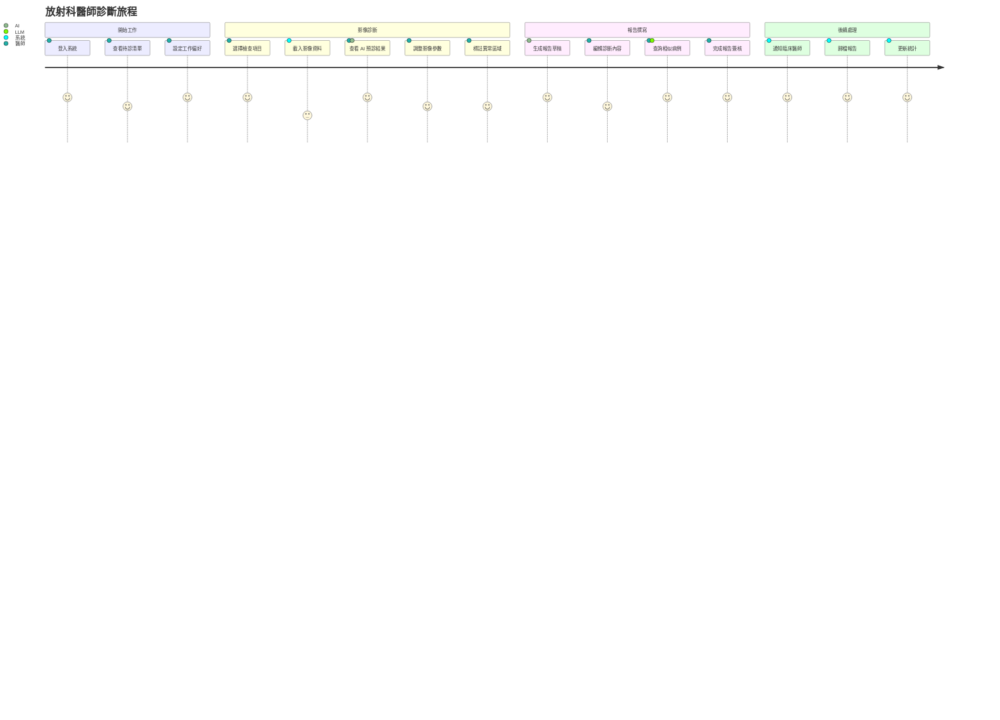
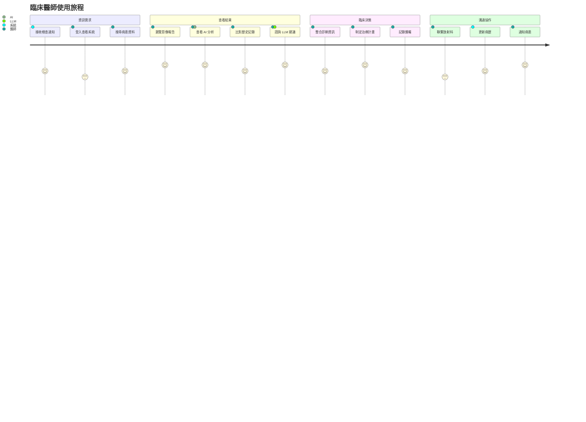
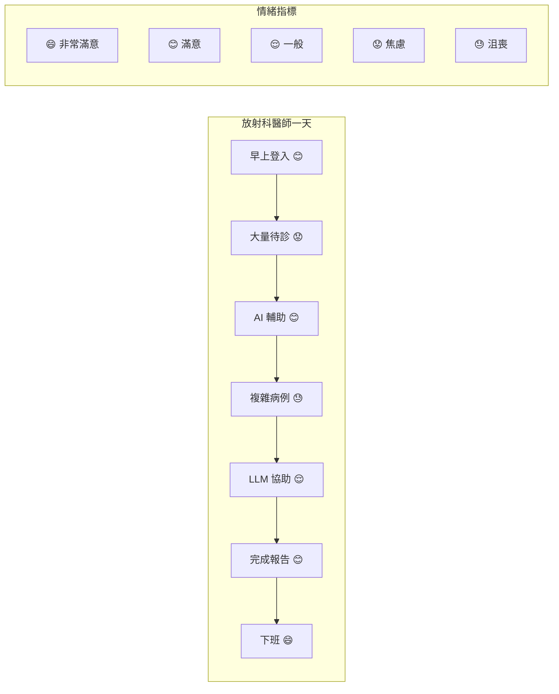
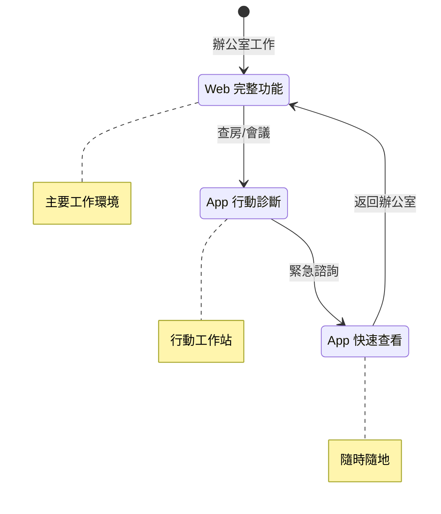
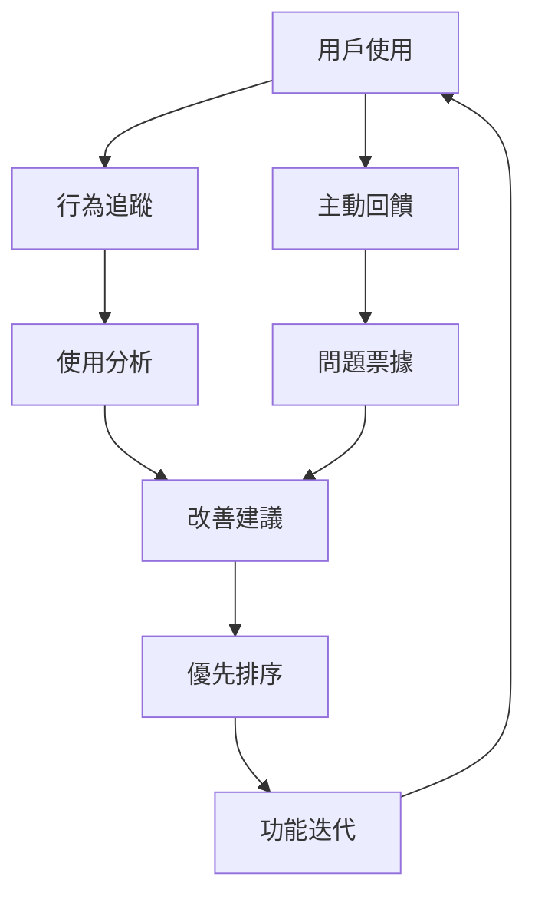

# 用戶旅程地圖

## 用戶角色定義

### 主要用戶角色

#### 1. 放射科醫師 (Dr. Chen)
```yaml
背景資料:
  年齡: 35-45 歲
  經驗: 10+ 年臨床經驗
  技術能力: 中等，熟悉 PACS 系統
  工作環境: 醫學中心放射科
  每日工作量: 50-80 份影像判讀

痛點:
  - 大量影像判讀壓力
  - 容易遺漏細微病變
  - 重複性工作佔用時間
  - 跨系統查找資料困難

目標:
  - 提高診斷效率
  - 降低誤診率
  - 專注於複雜病例
  - 工作生活平衡
```

#### 2. 臨床醫師 (Dr. Wang)
```yaml
背景資料:
  年齡: 30-50 歲
  專科: 內科/外科
  技術能力: 基礎到中等
  工作環境: 門診/住院部
  每日病患: 30-50 位

痛點:
  - 等待影像報告時間長
  - 無法快速查看歷史影像
  - 與放射科溝通不便
  - 缺乏 AI 輔助判讀

目標:
  - 快速獲得診斷資訊
  - 整合查看病歷資料
  - 提升診療決策品質
  - 改善病患滿意度
```

#### 3. 醫學研究員 (Dr. Lin)
```yaml
背景資料:
  年齡: 28-40 歲
  背景: 醫學博士/研究員
  技術能力: 高
  研究領域: 醫療 AI、影像分析
  資料需求: 大量標註資料

痛點:
  - 資料收集耗時
  - 標註品質不一
  - 缺乏批量處理工具
  - 研究資料管理混亂

目標:
  - 高效收集研究資料
  - 自動化資料處理
  - 訓練 AI 模型
  - 發表研究成果
```

---

## 核心用戶旅程

### 旅程 1：放射科醫師日常診斷流程



#### 詳細步驟分解

| 階段 | 步驟 | 用戶行動 | 系統回應 | 痛點 | 機會點 |
|------|------|----------|----------|------|--------|
| **1. 準備階段** | 登入 | 輸入帳密/生物識別 | 驗證身份，載入個人設定 | 多系統登入 | SSO 整合 |
| | 查看工作清單 | 點擊待診清單 | 顯示優先順序排序清單 | 無優先級 | AI 智能排序 |
| **2. 診斷階段** | 載入影像 | 選擇 Study | 預載入、顯示 AI 結果 | 載入緩慢 | 預測性載入 |
| | AI 輔助判讀 | 查看 AI 標註 | 高亮異常區域、信心分數 | AI 不準確 | 多模型驗證 |
| | 比對歷史 | 請求歷史影像 | 自動對齊、並排顯示 | 手動查找 | 智能匹配 |
| **3. 報告階段** | 撰寫報告 | 輸入診斷結果 | AI 生成建議文本 | 重複輸入 | 模板+AI |
| | 品質檢查 | 審核報告 | 提示遺漏項目 | 容易遺漏 | 智能提醒 |
| **4. 完成階段** | 簽核發布 | 電子簽章 | 發送通知、歸檔 | 流程繁瑣 | 一鍵完成 |

### 旅程 2：臨床醫師查閱診斷結果



#### 關鍵接觸點優化

| 接觸點 | 現狀問題 | 優化方案 | 預期效果 |
|--------|----------|----------|----------|
| **通知接收** | 被動等待、易遺漏 | 即時推送、多管道通知 | 回應時間 -50% |
| **結果查看** | 分散多系統 | 統一入口、整合顯示 | 查找時間 -70% |
| **AI 諮詢** | 無 AI 支援 | LLM 即時問答 | 決策信心 +40% |
| **歷史比對** | 手動查找對比 | 自動載入對齊 | 效率提升 60% |
| **科室溝通** | 電話、紙本 | 系統內協作 | 溝通效率 +80% |

### 旅程 3：研究員資料收集分析


---

## 用戶體驗地圖

### 情緒曲線分析



### 痛點與機會矩陣

| 痛點等級 | 痛點描述 | 影響用戶 | 解決方案 | 優先級 |
|---------|---------|---------|---------|--------|
| **🔴 嚴重** | 影像載入緩慢 | 所有醫師 | CDN 加速、預載入 | P0 |
| **🔴 嚴重** | AI 誤判率高 | 放射科醫師 | 多模型驗證 | P0 |
| **🟡 中等** | 報告重複輸入 | 放射科醫師 | AI 模板生成 | P1 |
| **🟡 中等** | 歷史資料查找 | 臨床醫師 | 智能搜尋 | P1 |
| **🟢 輕微** | 介面不夠直覺 | 新用戶 | UX 優化 | P2 |

---

## 服務藍圖

### 放射科診斷服務藍圖

```
用戶行動    |  登入  |  選擇Study  |  AI診斷  |  撰寫報告  |  發布  |
-----------|--------|-------------|----------|------------|--------|
前台接觸點  |  Web   |  工作清單   |  影像檢視器|  報告編輯器 |  簽核  |
           |  App   |  搜尋介面   |  AI結果   |  模板庫    |  通知  |
-----------|--------|-------------|----------|------------|--------|
後台行動    | 身份   |  資料查詢   | AI推論   |  自動儲存  | 發送   |
           | 驗證   |  影像載入   | 結果處理  |  版本控制  | 歸檔   |
-----------|--------|-------------|----------|------------|--------|
支援流程    | LDAP   |  PostgreSQL | TensorFlow|  Redis    | MQ     |
           | OAuth  |  S3 Storage | MLflow   |  Git      | Email  |
-----------|--------|-------------|----------|------------|--------|
實體證據    | 登入   |  影像列表   | AI標註   |  報告PDF  | 通知   |
           | 紀錄   |  載入進度   | 信心分數  |  電子簽章  | 記錄   |
```

---

## 跨渠道體驗設計

### 多端體驗一致性

| 功能 | Web 版 | 平板 App | 手機 App | 設計原則 |
|------|--------|----------|----------|----------|
| **影像檢視** | 完整功能 | 完整功能 | 簡化檢視 | 響應式設計 |
| **AI 結果** | 詳細顯示 | 詳細顯示 | 摘要顯示 | 漸進式揭露 |
| **報告編輯** | 完整編輯 | 完整編輯 | 僅查看 | 設備適配 |
| **LLM 問答** | 完整對話 | 完整對話 | 快速問答 | 場景優化 |
| **協作功能** | 全功能 | 全功能 | 基礎通訊 | 核心優先 |

### 無縫切換場景



---

## 個人化體驗設計

### 角色化介面配置

#### 放射科醫師介面
```yaml
預設配置:
  首頁: 待診工作清單
  快捷工具:
    - AI 診斷助手
    - 報告模板
    - 歷史影像比對

  介面布局:
    主區域: 影像檢視器 (70%)
    側邊欄: AI 結果 (20%)
    底部: 報告編輯 (10%)

客製化選項:
  - 工具列位置
  - 快捷鍵設定
  - AI 模型偏好
  - 報告模板
```

#### 臨床醫師介面
```yaml
預設配置:
  首頁: 病患列表
  快捷工具:
    - 最新報告
    - LLM 諮詢
    - 快速搜尋

  介面布局:
    主區域: 報告檢視 (60%)
    側邊欄: 病歷摘要 (25%)
    底部: 行動項目 (15%)

客製化選項:
  - 通知偏好
  - 顯示密度
  - 專科相關工具
  - 常用查詢
```

### 智能推薦系統

| 推薦類型 | 觸發條件 | 推薦內容 | 個人化程度 |
|---------|---------|---------|------------|
| **相似病例** | 查看診斷 | 歷史類似案例 | 基於專科 |
| **學習資源** | 查詢 LLM | 相關文獻、指引 | 基於等級 |
| **工作優化** | 使用模式 | 工作流程建議 | 基於行為 |
| **AI 模型** | 診斷類型 | 推薦適用模型 | 基於準確率 |

---

## 關鍵時刻 (Moments of Truth)

### 決定性時刻識別

| 時刻 | 場景 | 用戶期待 | 系統表現 | 改進方向 |
|------|------|----------|----------|----------|
| **首次使用** | 新用戶登入 | 簡單上手 | 引導教學 | 互動式教程 |
| **緊急診斷** | 急診案例 | 極速回應 | 優先處理 | 綠色通道 |
| **AI 異常** | AI 錯誤標註 | 可靠備案 | 人工覆核 | 多模型驗證 |
| **系統故障** | 服務中斷 | 資料安全 | 自動備份 | 離線模式 |
| **重大發現** | 發現病變 | 精確可靠 | 雙重確認 | 專家會診 |

### 關鍵績效指標 (KPI)

| 指標類別 | 指標名稱 | 目標值 | 測量方式 |
|---------|---------|--------|----------|
| **效率** | 平均診斷時間 | <3 分鐘 | 系統日誌 |
| **品質** | AI 輔助準確率 | >90% | 人工驗證 |
| **滿意度** | NPS 分數 | >70 | 問卷調查 |
| **採用率** | 日活躍率 | >80% | 使用統計 |
| **協作** | 跨科溝通次數 | +50% | 系統記錄 |

---

## 用戶故事集

### Epic 1: AI 輔助診斷
```
As a 放射科醫師
I want AI 自動標註異常區域
So that 我能更快發現病變
```

**子故事**:
- 載入影像時自動運行 AI 分析
- 顯示異常區域與信心分數
- 支援多個 AI 模型比對
- 允許修正 AI 結果

### Epic 2: 智能報告生成
```
As a 放射科醫師
I want AI 生成報告草稿
So that 減少重複性文書工作
```

**子故事**:
- 基於影像自動生成發現描述
- 提供常見診斷模板
- 支援語音輸入編輯
- 自動檢查完整性

### Epic 3: LLM 醫療諮詢
```
As a 臨床醫師
I want 詢問 LLM 關於診斷的問題
So that 獲得即時醫療建議
```

**子故事**:
- 自然語言提問介面
- 基於病歷上下文回答
- 提供參考文獻連結
- 儲存問答歷史

---

## 無障礙設計考量

### 可及性需求

| 用戶類型 | 特殊需求 | 設計考量 | 實施方案 |
|---------|----------|----------|----------|
| **視力障礙** | 放大/朗讀 | 高對比模式 | WCAG 2.1 AA |
| **色盲用戶** | 色彩區分 | 形狀標記 | 多種標記方式 |
| **行動不便** | 鍵盤操作 | 快捷鍵 | 完整鍵盤導航 |
| **認知障礙** | 簡化介面 | 漸進揭露 | 簡易模式 |

### 多語言支援

```yaml
支援語言:
  - 繁體中文 (預設)
  - 簡體中文
  - English
  - 日本語 (計劃中)

在地化內容:
  - 醫學術語
  - 報告模板
  - 操作介面
  - 錯誤訊息

切換方式:
  - 用戶偏好設定
  - 自動偵測
  - 快速切換按鈕
```

---

## 用戶回饋循環

### 回饋收集機制



### 持續改進流程

| 階段 | 活動 | 頻率 | 負責團隊 |
|------|------|------|----------|
| **收集** | 用戶訪談 | 每月 | UX 團隊 |
| **分析** | 數據分析 | 每週 | 數據團隊 |
| **設計** | 原型設計 | 雙週 | 設計團隊 |
| **驗證** | A/B 測試 | 持續 | 產品團隊 |
| **發布** | 功能更新 | 每月 | 開發團隊 |

---

*本章節定義用戶體驗設計與優化策略*
*最後更新：2024-11-12*