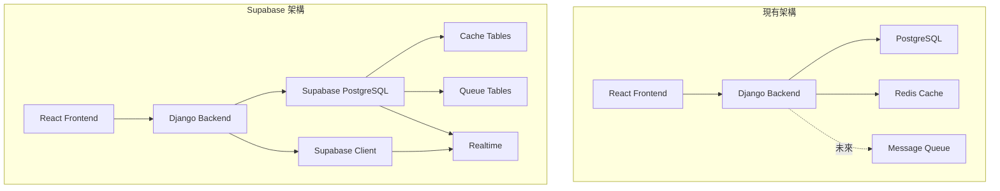

# Supabase 技術架構設計文件

## 系統架構總覽

### 架構轉換圖



---

## 快取系統設計

### 資料表架構

```sql
-- 快取資料表
CREATE TABLE django_cache (
    cache_key VARCHAR(255) PRIMARY KEY,
    value JSONB NOT NULL,
    expires_at TIMESTAMPTZ NOT NULL,
    created_at TIMESTAMPTZ DEFAULT NOW()
);

-- 效能優化索引
CREATE INDEX idx_cache_expires ON django_cache(expires_at);
CREATE INDEX idx_cache_created ON django_cache(created_at);
```

### Django 快取後端實作

```python
# studies/cache_backend.py 核心介面
class SupabaseCache(BaseCache):
    """
    Supabase PostgreSQL 快取後端

    特性：
    - JSONB 儲存支援複雜資料結構
    - 自動過期處理
    - 連接池優化
    - 批次操作支援
    """

    def get(self, key, default=None, version=None):
        """取得快取值"""

    def set(self, key, value, timeout=DEFAULT_TIMEOUT, version=None):
        """設定快取值"""

    def delete(self, key, version=None):
        """刪除快取"""

    def clear(self):
        """清除所有快取"""
```

### 快取策略配置

| 快取類型 | TTL | 使用場景 | 優先級 |
|---------|-----|---------|--------|
| 查詢結果 | 5分鐘 | Study 搜尋結果 | 高 |
| 統計數據 | 1小時 | 報表統計 | 中 |
| 靜態資料 | 24小時 | 設備列表、房間列表 | 低 |
| 會話資料 | 30分鐘 | 使用者會話 | 高 |

---

## 訊息佇列系統設計

### 資料表架構

```sql
-- 工作佇列主表
CREATE TABLE job_queue (
    id SERIAL PRIMARY KEY,
    queue_name VARCHAR(100) NOT NULL,
    job_type VARCHAR(100),
    payload JSONB NOT NULL,
    priority INTEGER DEFAULT 5,
    status VARCHAR(20) DEFAULT 'pending',
    scheduled_at TIMESTAMPTZ DEFAULT NOW(),
    created_at TIMESTAMPTZ DEFAULT NOW(),
    started_at TIMESTAMPTZ,
    completed_at TIMESTAMPTZ,
    error_message TEXT,
    retry_count INTEGER DEFAULT 0,
    max_retries INTEGER DEFAULT 3,
    timeout_seconds INTEGER DEFAULT 300,
    result JSONB
);

-- 死信佇列
CREATE TABLE job_queue_dead_letter (
    id SERIAL PRIMARY KEY,
    original_job_id INTEGER,
    queue_name VARCHAR(100) NOT NULL,
    job_type VARCHAR(100),
    payload JSONB NOT NULL,
    error_message TEXT,
    failure_count INTEGER,
    failed_at TIMESTAMPTZ DEFAULT NOW(),
    original_created_at TIMESTAMPTZ
);
```

### 佇列管理器實作

```python
# studies/queue_manager.py 核心類別
class JobQueue:
    """
    資料庫支援的工作佇列

    特性：
    - SKIP LOCKED 並發處理
    - 自動重試與指數退避
    - 死信佇列管理
    - 優先級排程
    """

    @classmethod
    def enqueue(cls, queue_name, payload, **options):
        """加入工作到佇列"""

    @classmethod
    def dequeue(cls, queue_name, job_types=None):
        """從佇列取出工作（帶鎖）"""

    @classmethod
    def complete(cls, job_id, result=None):
        """標記工作完成"""

    @classmethod
    def fail(cls, job_id, error_message):
        """標記工作失敗（含重試邏輯）"""
```

### 工作處理器設計

```python
class QueueWorker:
    """
    通用佇列工作處理器

    使用範例：
    worker = QueueWorker(
        queue_name='background_tasks',
        job_handlers={
            'send_email': process_email,
            'generate_report': process_report,
        }
    )
    worker.run()
    """
```

### 佇列使用案例

| 佇列名稱 | 用途 | 優先級 | 重試次數 | 逾時(秒) |
|---------|------|--------|---------|---------|
| email_queue | 郵件發送 | 5 | 3 | 30 |
| report_queue | 報表生成 | 3 | 2 | 300 |
| export_queue | 資料匯出 | 3 | 2 | 600 |
| notification_queue | 通知推送 | 8 | 5 | 10 |
| maintenance_queue | 維護任務 | 1 | 1 | 3600 |

---

## 即時訂閱系統設計

### Realtime 整合架構

```python
# studies/realtime.py
from supabase import create_client, Client

class RealtimeManager:
    """
    Supabase Realtime 管理器

    功能：
    - 快取失效通知
    - 工作狀態更新
    - 資料變更推送
    """

    def __init__(self):
        self.client = create_client(
            settings.SUPABASE_URL,
            settings.SUPABASE_ANON_KEY
        )

    def subscribe_cache_invalidation(self, callback):
        """訂閱快取失效事件"""

    def subscribe_job_status(self, queue_name, callback):
        """訂閱工作狀態變更"""

    def subscribe_data_changes(self, table, callback):
        """訂閱資料表變更"""
```

### 訂閱使用案例

| 事件類型 | 觸發條件 | 處理動作 |
|---------|---------|---------|
| cache_invalidation | 快取更新/刪除 | 清除本地快取 |
| job_status_change | 工作狀態變更 | 更新 UI 狀態 |
| study_created | 新增檢查記錄 | 即時通知前端 |
| report_updated | 報告更新 | 刷新報告列表 |

---

## 連線池配置

### Supabase 連線管理

```python
# settings.py
DATABASES = {
    'default': {
        'ENGINE': 'django.db.backends.postgresql',
        'NAME': 'postgres',
        'USER': 'postgres',
        'PASSWORD': os.getenv('SUPABASE_DB_PASSWORD'),
        'HOST': os.getenv('SUPABASE_DB_HOST'),
        'PORT': 6543,  # Supavisor pooler port
        'OPTIONS': {
            'sslmode': 'require',
            'connect_timeout': 10,
            'keepalives': 1,
            'keepalives_idle': 30,
            'keepalives_interval': 10,
            'keepalives_count': 5,
        },
        'CONN_MAX_AGE': 60,  # 連線重用
        'CONN_HEALTH_CHECKS': True,
    }
}

# 連線池配置
DATABASES['default']['OPTIONS']['pool_size'] = 20
DATABASES['default']['OPTIONS']['max_overflow'] = 10
```

### 連線池優化策略

| 參數 | 開發環境 | 生產環境 | 說明 |
|------|---------|---------|------|
| pool_size | 5 | 20 | 基本連線數 |
| max_overflow | 5 | 10 | 超載連線數 |
| pool_recycle | 300 | 3600 | 連線回收時間 |
| pool_pre_ping | True | True | 連線健康檢查 |
| pool_timeout | 10 | 30 | 連線逾時 |

---

## 效能優化策略

### 資料庫優化

```sql
-- 1. 部分索引優化查詢
CREATE INDEX idx_study_pending
ON studies_study(order_datetime DESC)
WHERE exam_status = 'pending';

-- 2. 物化視圖加速統計
CREATE MATERIALIZED VIEW study_statistics AS
SELECT
    exam_source,
    exam_status,
    COUNT(*) as count,
    DATE(order_datetime) as date
FROM studies_study
GROUP BY exam_source, exam_status, DATE(order_datetime);

-- 3. 分區表處理歷史資料
CREATE TABLE studies_study_2024 PARTITION OF studies_study
FOR VALUES FROM ('2024-01-01') TO ('2025-01-01');
```

### 查詢優化

| 優化技術 | 應用場景 | 預期改善 |
|---------|---------|---------|
| 連線查詢改寫 | 多表關聯 | 30-50% |
| 索引覆蓋 | 常用查詢 | 50-70% |
| 批次處理 | 大量寫入 | 60-80% |
| 查詢快取 | 重複查詢 | 80-90% |

### 應用層優化

```python
# 1. 查詢結果分頁
from django.core.paginator import Paginator

def get_studies(request):
    studies = Study.objects.select_related().prefetch_related()
    paginator = Paginator(studies, 20)

# 2. 批次操作
Study.objects.bulk_create(studies, batch_size=100)
Study.objects.bulk_update(studies, ['status'], batch_size=100)

# 3. 非同步處理
from asgiref.sync import async_to_sync
from channels.layers import get_channel_layer

async def notify_update(study_id):
    channel_layer = get_channel_layer()
    await channel_layer.group_send(
        f"study_{study_id}",
        {"type": "study.update"}
    )
```

---

## 監控與維護

### 監控指標

```yaml
資料庫指標:
  - 連線池使用率
  - 查詢回應時間 (P50, P95, P99)
  - 慢查詢數量
  - 資料表大小增長

快取指標:
  - 命中率
  - 回應時間分布
  - 驅逐率
  - 記憶體使用量

佇列指標:
  - 佇列深度
  - 處理延遲
  - 失敗率
  - 重試率

應用指標:
  - API 回應時間
  - 錯誤率
  - 請求吞吐量
  - 並發使用者數
```

### 維護排程

| 任務 | 頻率 | 執行時間 | 優先級 |
|------|------|---------|--------|
| 快取清理 | 每5分鐘 | 自動 | 高 |
| 佇列清理 | 每日 | 02:00 | 中 |
| 資料庫清理 | 每週 | 週日 03:00 | 低 |
| 效能分析 | 每月 | 月初 | 中 |
| 容量規劃 | 每季 | 季初 | 高 |

---

## 安全性設計

### Row Level Security (RLS)

```sql
-- 啟用 RLS
ALTER TABLE studies_study ENABLE ROW LEVEL SECURITY;

-- 建立存取策略
CREATE POLICY "醫護人員可查看所有記錄"
ON studies_study FOR SELECT
USING (auth.jwt() ->> 'role' = 'medical_staff');

CREATE POLICY "病患只能查看自己的記錄"
ON studies_study FOR SELECT
USING (auth.jwt() ->> 'patient_id' = patient_id::text);
```

### 資料加密

| 層級 | 加密方式 | 應用範圍 |
|------|---------|---------|
| 傳輸層 | TLS 1.3 | 所有連線 |
| 儲存層 | AES-256 | 敏感資料 |
| 應用層 | Django 加密欄位 | PII 資料 |
| 備份 | 加密備份 | 所有備份 |

---

## 災難復原計劃

### 備份策略

```yaml
備份類型:
  每日備份:
    時間: 03:00
    保留: 7天
    類型: 增量

  每週備份:
    時間: 週日 04:00
    保留: 4週
    類型: 完整

  每月備份:
    時間: 月底
    保留: 12個月
    類型: 完整
```

### 復原程序

| 階段 | 動作 | RTO | RPO |
|------|------|-----|-----|
| 偵測 | 監控告警 | 5分鐘 | - |
| 評估 | 確認影響範圍 | 15分鐘 | - |
| 復原 | 執行復原程序 | 1小時 | 1小時 |
| 驗證 | 確認服務正常 | 30分鐘 | - |
| **總計** | **完整復原** | **2小時** | **1小時** |

---

*文件版本：1.0*
*最後更新：2024-11-12*
*負責團隊：技術架構組*