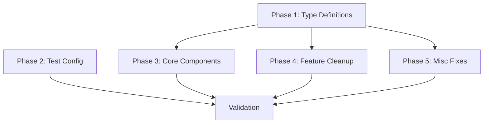

# Tasks: Fix Frontend TypeScript Errors

## Phase 1: Type Definition Foundation (Blocking)

### Task 1.1: Fix Type Re-export Conflicts ✅
**File**: `src/types/index.ts`
**Error**: TS2308 - Module has already exported member
**Action**:
- [x] 明確 re-export 解決 `PaginatedResponse` 和 `SortOption` 的衝突
- [x] 使用 `export { X as Y }` 或移除重複導出

### Task 1.2: Fix ProjectStatus Type ✅
**Files**: `src/types/project.ts`, `src/services/project.ts`
**Error**: TS2430 - Interface incorrectly extends
**Action**:
- [x] 確保 ProjectStatus 類型包含 "archived" 和 "active"
- [x] 修正 `ProjectListApiItem` 的 status 類型

### Task 1.3: Fix User Type ✅
**File**: `src/types/user.ts`
**Error**: TS2339 - Property 'role' does not exist
**Action**:
- [x] 在 User 類型中添加 `role` 屬性
- [x] 更新 `src/test/mocks/authMocks.ts` 中的 mock 物件

### Task 1.4: Fix .d.ts Import Issues ✅
**Files**: `src/hooks/useProjectResourceBatchActions.ts`, `src/utils/projectResourceBatchActionsRegistry.ts`
**Error**: TS6137 - Cannot import type declaration files
**Action**:
- [x] 將 `@types/projectResource` 改為正確的類型導入路徑
- [x] 確認類型檔案位置是否正確

---

## Phase 2: Test Configuration (Parallel with Phase 3)

### Task 2.1: Configure Test Types ✅
**File**: `tsconfig.json` 或新增 `tsconfig.test.json`
**Error**: TS2582, TS2304 - Cannot find test runner types
**Action**:
- [x] 確認已安裝 `@types/jest` 或 `@types/vitest`
- [x] 將測試檔案納入 tsconfig 的 include 範圍
- [x] 或為測試建立獨立的 tsconfig

---

## Phase 3: Core Component Fixes (Sequential within, Parallel with Phase 2)

### Task 3.1: Fix QueryBuilder Type Errors ✅
**File**: `src/components/Search/QueryBuilder.tsx`
**Errors**: TS2322, TS2339, TS2345 (約 15 個錯誤)
**Action**:
- [x] 定義 `NodeWithIds` 類型確保 `id` 為必填
- [x] 為 `value` 屬性添加型別守衛 (type guard)
- [x] 修正 readonly array 的可變性問題

### Task 3.2: Fix listViewStore Generic Types ✅
**File**: `src/store/listViewStore.ts`
**Error**: TS2322, TS2769, TS2345
**Action**:
- [x] 修正 `SelectionSummary` 的 mode 類型
- [x] 調整泛型約束解決類型推斷問題

### Task 3.3: Fix Project Hooks Type Mismatches ✅
**Files**: `src/hooks/projects/useProjectAssignment.ts`, `src/hooks/projects/useProjectDetails.ts`
**Error**: TS2345 - API response type mismatch
**Action**:
- [x] 對齊 API 回應類型與期望類型
- [x] 修正 status 類型為正確的 union type

---

## Phase 4: Feature Component Cleanup (Parallel)

### Task 4.1: Remove Unused Imports - AIAssistant ✅
**Files**:
- `src/components/AIAssistant/ChatDialog.tsx`
- `src/components/AIAssistant/PromptTemplateManager.tsx`
- `src/components/AIAssistant/ReportAIDrawer.tsx`
**Error**: TS6133 - Declared but never read
**Action**:
- [x] 移除未使用的 imports

### Task 4.2: Remove Unused Imports - StudySearch ✅
**Files**:
- `src/components/StudySearch/StudyDetailDrawer.tsx`
- `src/components/StudySearch/StudyDetailModal.tsx`
**Error**: TS6133 - Declared but never read
**Action**:
- [x] 移除未使用的 imports

### Task 4.3: Remove Unused Imports - Common & Pages ✅
**Files**:
- `src/components/Common/SelectionDrawer.example.tsx`
- `src/pages/Reports/ReportDetail.tsx`
- `src/utils/paginatedFetch.ts`
**Error**: TS6133 - Declared but never read
**Action**:
- [x] 移除未使用的 imports 和未使用的變數

---

## Phase 5: Miscellaneous Fixes (Parallel)

### Task 5.1: Fix ProjectSelectionModal ✅
**File**: `src/components/Common/ProjectSelectionModal.tsx`
**Error**: TS2448, TS2454 - Variable used before declaration
**Action**:
- [x] 調整 `fetchProjects` 的宣告順序

### Task 5.2: Fix AIAnalysis Page ✅
**File**: `src/pages/AIAnalysis/index.tsx`
**Error**: TS2322, TS2345 - Unknown type assignment
**Action**:
- [x] 為 unknown 類型添加明確的類型斷言

### Task 5.3: Fix ProjectAssignmentModal ✅
**File**: `src/components/StudySearch/ProjectAssignmentModal.tsx`
**Error**: TS2538 - Undefined cannot be used as index
**Action**:
- [x] 添加 undefined 檢查

### Task 5.4: Fix Export Service ✅
**File**: `src/services/export.ts`
**Error**: TS2345 - AxiosResponse headers type
**Action**:
- [x] 調整 headers 的類型處理

### Task 5.5: Fix ReportDetail Date Handling ✅
**File**: `src/pages/Reports/ReportDetail.tsx`
**Error**: TS2345 - Date not assignable to string
**Action**:
- [x] 確保 Date 轉換為 string

### Task 5.6: Fix DataImport Page ✅
**File**: `src/pages/DataImport/index.tsx`
**Error**: TS2345 - ImportTask type mismatch
**Action**:
- [x] 修正 state 類型定義

### Task 5.7: Fix Project Pages Type Casting ✅
**Files**:
- `src/pages/Projects/Detail/ProjectReportList.tsx`
- `src/pages/Projects/Detail/ProjectStudyList.tsx`
- `src/pages/Projects/Detail/ProjectResourceListViewProvider.tsx`
- `src/pages/Projects/Detail/ProjectResourceWorkbench.tsx`
- `src/pages/Projects/Detail/ResourceSelector.tsx`
**Error**: TS2322, TS2339, TS2352, TS2614
**Action**:
- [x] 修正類型轉換和導入問題

### Task 5.8: Fix App.tsx Router Config ✅
**File**: `src/App.tsx`
**Error**: TS2353 - v7_startTransition does not exist
**Action**:
- [x] 移除或修正過時的 router 配置選項

### Task 5.9: Fix SelectionDrawer Example ✅
**File**: `src/components/Common/SelectionDrawer.example.tsx`
**Error**: TS2353 - is_favorite does not exist
**Action**:
- [x] 修正範例檔案的類型

### Task 5.10: Fix AIAnalysisForm Error Handling ✅
**Files**:
- `src/components/Reports/AIAnalysisForm.tsx`
- `src/components/Reports/BatchAIAnalysisModal.tsx`
**Error**: TS2339 - errorFields does not exist
**Action**:
- [x] 修正 form validation 錯誤類型

---

## Validation

### Task V.1: Run TypeScript Check ✅
```bash
npx tsc --noEmit
```
**Result**: 0 errors ✅

### Task V.2: Run Dev Server
```bash
pnpm dev
```
**Expected**: Application starts without errors

### Task V.3: Basic Functionality Test
- 驗證主要頁面可正常載入
- 驗證搜尋功能正常運作

---

## Dependencies



**Parallelization Notes**:
- Phase 2, 3, 4, 5 可在 Phase 1 完成後平行執行
- 各 Phase 內的 Tasks 可根據檔案獨立性平行執行
- 驗證必須在所有修復完成後執行

---

## Phase 6: eslint-disable Refactoring (Martin Fowler Code Quality)

> "Code smell is a surface indication that usually corresponds to a deeper problem in the system."

### Task 6.1: Fix i18next.d.ts - Replace `any` with `unknown` ✅
**File**: `src/i18next.d.ts`
**Code Smell**: Primitive Obsession
**Action**:
- [x] 將 `Record<string, any>` 改為 `Record<string, unknown>`
- [x] 移除 `eslint-disable @typescript-eslint/no-explicit-any`
- [x] 驗證 i18next 功能正常

### Task 6.2: Extract Module from useReportTableColumns.tsx ✅
**Files**:
- `src/hooks/useReportTableColumns.tsx` (原檔案)
- `src/utils/reportTableConfig.ts` (新檔案)
**Code Smell**: Large Class / Feature Envy (混合職責)
**Action**:
- [x] 建立 `src/utils/reportTableConfig.ts`
- [x] 移動 constants: `REPORT_COLUMN_KEYS`, `DEFAULT_COLUMN_ORDER`, `DEFAULT_REPORT_COLUMN_CONFIG`
- [x] 移動 utils: `formatDate`, `getReportTypeLabel`, `getReportTypeColor`
- [x] 更新 `useReportTableColumns.tsx` 從新檔案 import
- [x] 移除 `eslint-disable react-refresh/only-export-components`
- [x] 更新所有引用此模組的檔案

### Task 6.3: Clean SelectionDrawer.example.tsx - Remove Unused Destructuring ✅
**File**: `src/components/Common/SelectionDrawer.example.tsx`
**Code Smell**: Comments (需要 eslint-disable 才能通過)
**Action**:
- [x] 移除 `_selectedRowKeys` 解構
- [x] 移除 `_handleSelectionChange` 解構
- [x] 移除 `eslint-disable @typescript-eslint/no-unused-vars`
- [x] 確保範例程式碼展示最佳實踐

### Task 6.4: Refactor PromptTemplateManager.tsx - useCallback Pattern ✅
**File**: `src/components/AIAssistant/PromptTemplateManager.tsx`
**Code Smell**: Feature Envy (隱藏依賴)
**Action**:
- [x] 將 `loadTemplates` 用 `useCallback` 包裝
- [x] 明確宣告 `[filters]` 為依賴
- [x] 更新 `useEffect` 依賴為 `[loadTemplates]`
- [x] 移除 `eslint-disable-next-line react-hooks/exhaustive-deps`

### Task 6.5: Fix ProjectReportListViewProvider.tsx - Use Concrete Types ✅
**File**: `src/pages/Projects/Detail/ProjectReportListViewProvider.tsx`
**Code Smell**: Primitive Obsession
**Action**:
- [x] 將 `ListViewConfig<any, any>` 改為 `ListViewConfig<Report, ListViewQuery>`
- [x] 確保 `Report` 和 `ListViewQuery` 類型已正確導入
- [x] 移除 `eslint-disable-next-line @typescript-eslint/no-explicit-any`

---

## Phase 6 Validation

### Task 6.V1: Run ESLint Check
```bash
pnpm lint
```
**Expected**: 0 errors, 0 warnings

### Task 6.V2: Run TypeScript Check
```bash
npx tsc --noEmit
```
**Expected**: 0 errors

### Task 6.V3: Verify eslint-disable Usage
```bash
grep -r "eslint-disable" src/
```
**Expected**: 僅保留 `ProjectFilters.tsx` 的 debounce 相關 disable（有合理技術說明）

---

## Completion Summary

### Phase 1-5 (已完成)
**Total Errors Fixed**: 92 → 0
**Phases Completed**: 5/5
**Tasks Completed**: All tasks marked complete

### Key Fixes Applied:
1. **Type Re-exports**: Fixed duplicate exports in `src/types/index.ts`
2. **Generic Types**: Fixed listViewStore generic context pattern with proper type casts
3. **QueryBuilder**: Changed NodeWithIds from intersection type to explicit interface
4. **Test Configuration**: Added vitest types to tsconfig
5. **Unused Imports**: Removed ~22 unused imports across multiple files
6. **Type Guards**: Added proper type guards for unknown types
7. **Date Handling**: Fixed formatDate to return string consistently
8. **API Response Types**: Added type assertions for API response mismatches

### Phase 6 (已完成)
**eslint-disable Refactoring**: 5 files refactored ✅
**Result**:
- `pnpm lint` → 0 errors, 0 warnings
- `npx tsc --noEmit` → 0 errors
- `grep -r "eslint-disable" src/` → 僅剩 `ProjectFilters.tsx` debounce（有合理技術說明）
- 符合 Martin Fowler 程式碼品質標準
